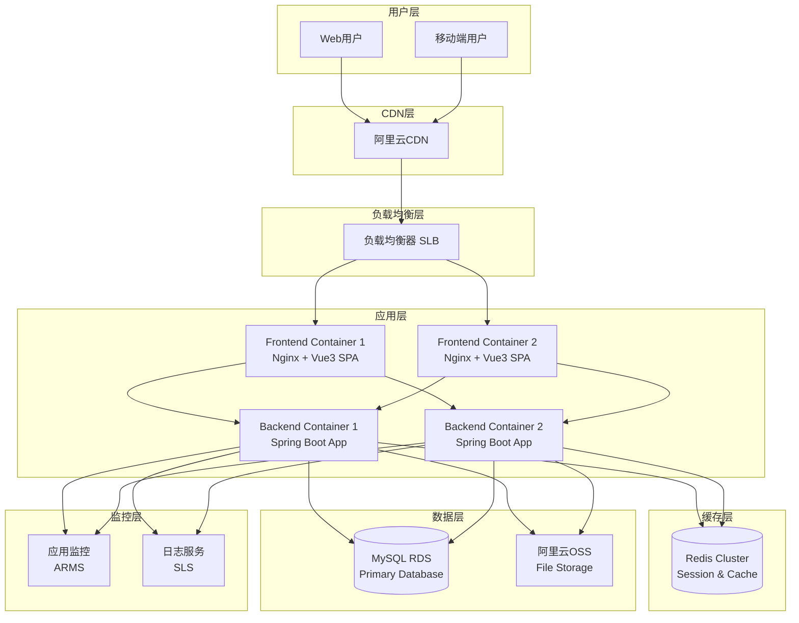
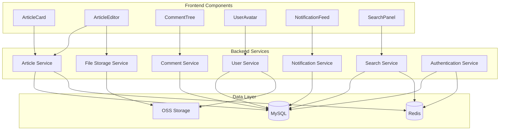
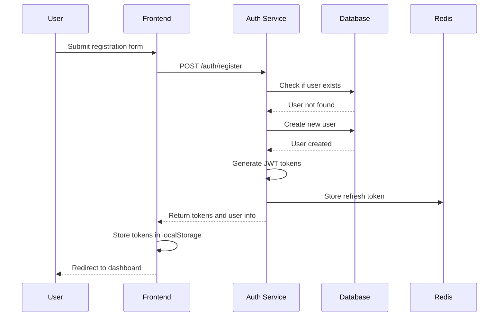
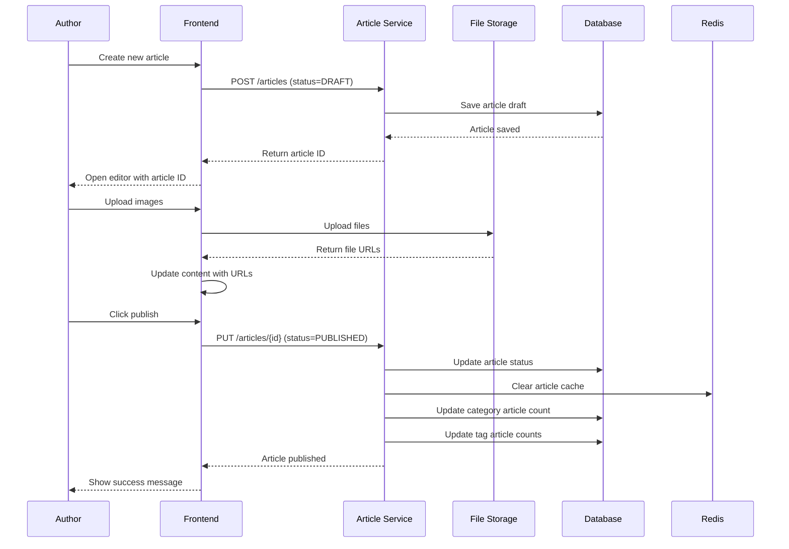
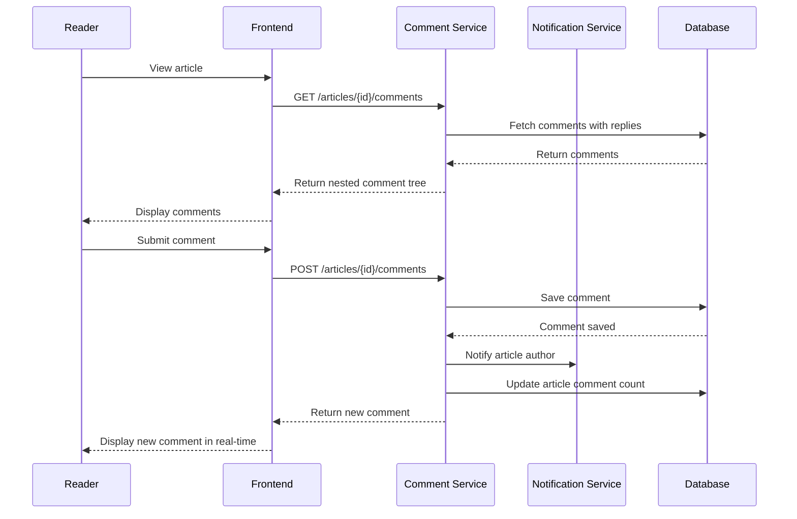
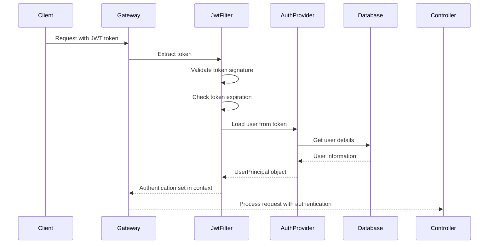

# 大学生个人博客系统 Fullstack Architecture Document

<!-- Powered by BMAD™ Core -->

## Introduction

This document outlines the complete fullstack architecture for 大学生个人博客系统, including backend systems, frontend implementation, and their integration. It serves as the single source of truth for AI-driven development, ensuring consistency across the entire technology stack.

This unified approach combines what would traditionally be separate backend and frontend architecture documents, streamlining the development process for modern fullstack applications where these concerns are increasingly intertwined.

### Starter Template or Existing Project

N/A - Greenfield project

### Change Log

| Date | Version | Description | Author |
|------|---------|-------------|---------|
| 2025-12-15 | 1.0 | Initial architecture document creation | Winston (Architect) |

## High Level Architecture

### Technical Summary

This is a monolithic fullstack application built with Spring Boot backend and Vue3 frontend, deployed on a cloud platform with MySQL database and Redis cache. The architecture follows traditional MVC patterns on the backend with RESTful APIs, while the frontend uses a component-based architecture with Vue3 Composition API. The system is designed for scalability with horizontal scaling capabilities, though initially deployed as a single instance. Authentication is handled via JWT tokens with refresh mechanism, and the entire application is containerized using Docker for consistent deployment environments.

### Platform and Infrastructure Choice

**Platform:** 阿里云 (Alibaba Cloud)
**Key Services:** ECS (Elastic Compute Service), RDS for MySQL, Redis for caching, OSS for file storage, SLB for load balancing
**Deployment Host and Regions:** 华东1 (杭州) Region

**Rationale for Platform Choice:**
- 阿里云在国内的网络优势，为大学生用户群体提供更好的访问速度
- 完整的产品生态，涵盖计算、存储、数据库、CDN等所需服务
- 有学生优惠计划，符合项目预算考虑
- 提供Docker容器支持，便于现代化部署
- 稳定的服务和技术支持

### Repository Structure

**Structure:** Monorepo
**Monorepo Tool:** Maven多模块 + npm workspaces
**Package Organization:**
- blog-backend: Spring Boot后端模块
- blog-frontend: Vue3前端模块
- blog-shared: 共享类型定义和工具类
- blog-docs: 项目文档

### High Level Architecture Diagram



### Architectural Patterns

- **MVC Pattern:** Backend follows Model-View-Controller pattern - _Rationale:_ Clear separation of concerns, established Spring Boot pattern
- **Component-Based UI:** Reusable Vue3 components with Composition API - _Rationale:_ Modern, maintainable frontend architecture with TypeScript support
- **RESTful API Design:** Standard HTTP methods and status codes - _Rationale:_ Widely understood, stateless, cacheable by nature
- **Repository Pattern:** Abstract data access logic - _Rationale:_ Enables testing and future database migration flexibility
- **JWT Authentication:** Token-based stateless authentication - _Rationale:_ Scalable, works well with microservices architecture
- **CQRS (Command Query Responsibility Segregation):** Separate read/write operations for complex queries - _Rationale:_ Performance optimization for read-heavy operations
- **Event-Driven Architecture:** Asynchronous processing for non-critical operations - _Rationale:_ Improves system responsiveness and scalability

## Tech Stack

### Technology Stack Table

| Category | Technology | Version | Purpose | Rationale |
|----------|------------|---------|---------|-----------|
| Frontend Language | TypeScript | 5.0+ | Type-safe JavaScript development | Compile-time type checking improves code quality and maintainability |
| Frontend Framework | Vue 3 | 3.4+ | Reactive UI framework | Composition API provides better TypeScript support and logic reuse |
| UI Component Library | Element Plus | 2.4+ | Vue 3 component library | Rich component ecosystem, excellent TypeScript support, Chinese-friendly |
| State Management | Pinia | 2.1+ | Vue state management | Modern, intuitive API with excellent TypeScript support |
| Backend Language | Java | 17 | Backend programming language | LTS version with modern language features, excellent performance |
| Backend Framework | Spring Boot | 3.2+ | Java application framework | Mature ecosystem, rapid development, production-ready features |
| API Style | REST | - | API design standard | Simple, stateless, widely adopted, excellent tooling support |
| Database | MySQL | 8.0 | Relational database storage | Mature, reliable, excellent performance for relational data |
| Cache | Redis | 7.0+ | In-memory caching and session storage | High performance, supports complex data structures |
| File Storage | Alibaba Cloud OSS | - | Object storage for user uploads | Scalable, cost-effective, integrates well with Alibaba Cloud |
| Authentication | JWT (jjwt library) | 0.12+ | Token-based authentication | Stateless, scalable, works well with REST APIs |
| Frontend Testing | Vitest + Vue Test Utils | 1.0+ | Unit and component testing | Fast, modern testing solution with excellent Vue integration |
| Backend Testing | JUnit 5 + Mockito | 5.10+ | Unit and integration testing | Industry standard for Java testing, comprehensive assertions |
| E2E Testing | Playwright | 1.40+ | End-to-end testing | Cross-browser support, reliable, modern API |
| Build Tool | Maven | 3.9+ | Java build and dependency management | Mature, widely adopted, excellent dependency management |
| Bundler | Vite | 5.0+ | Frontend build tool | Lightning-fast HMR, optimized builds, modern development experience |
| IaC Tool | Docker | 24.0+ | Containerization | Consistent environments, simplifies deployment, industry standard |
| CI/CD | GitHub Actions | - | Continuous integration and deployment | Free for public repos, excellent GitHub integration |
| Monitoring | Spring Boot Actuator + Micrometer | 3.2+ | Application metrics and health checks | Built-in metrics, extensive monitoring ecosystem support |
| Logging | SLF4J + Logback | 2.0+ | Structured logging | Industry standard, flexible configuration, excellent performance |
| CSS Framework | Element Plus CSS Variables | 2.4+ | UI styling and theming | Consistent design system, easy customization, dark mode support |

## Data Models

### User

**Purpose:** Represents system users including students and administrators, managing authentication and profile information.

**Key Attributes:**
- id: Long - Unique identifier for the user
- username: String - Unique username for login (3-20 characters)
- email: String - User's email address for login and notifications
- password: String - Encrypted password hash
- nickname: String - Display name for the user (optional)
- avatar: String - Profile picture URL stored in OSS
- bio: String - User biography or introduction
- role: UserRole - User role (USER or ADMIN)
- status: UserStatus - Account status (ACTIVE, INACTIVE, BANNED)
- createTime: LocalDateTime - Account creation timestamp
- updateTime: LocalDateTime - Last update timestamp
- lastLoginTime: LocalDateTime - Last successful login time

#### TypeScript Interface

```typescript
export interface User {
  id: number;
  username: string;
  email: string;
  nickname?: string;
  avatar?: string;
  bio?: string;
  role: 'USER' | 'ADMIN';
  status: 'ACTIVE' | 'INACTIVE' | 'BANNED';
  createTime: string;
  updateTime: string;
  lastLoginTime?: string;
}
```

#### Relationships
- One-to-many with Article (user can have many articles)
- One-to-many with Comment (user can have many comments)
- Many-to-many with Article through ArticleLike (user can like many articles)

### Article

**Purpose:** Represents blog posts created by users, managing content and metadata.

**Key Attributes:**
- id: Long - Unique identifier for the article
- title: String - Article title (required, max 200 characters)
- content: String - Article content in Markdown format
- summary: String - Article summary for list display
- coverImage: String - Cover image URL stored in OSS
- status: ArticleStatus - Article status (DRAFT, PUBLISHED, DELETED)
- viewCount: Integer - Number of times the article has been viewed
- likeCount: Integer - Number of likes the article has received
- commentCount: Integer - Number of comments on the article
- isTop: Boolean - Whether the article is pinned to top
- authorId: Long - Foreign key to User table
- categoryId: Long - Foreign key to Category table
- createTime: LocalDateTime - Article creation timestamp
- updateTime: LocalDateTime - Last update timestamp
- publishTime: LocalDateTime - Publication timestamp

#### TypeScript Interface

```typescript
export interface Article {
  id: number;
  title: string;
  content: string;
  summary?: string;
  coverImage?: string;
  status: 'DRAFT' | 'PUBLISHED' | 'DELETED';
  viewCount: number;
  likeCount: number;
  commentCount: number;
  isTop: boolean;
  authorId: number;
  categoryId: number;
  createTime: string;
  updateTime: string;
  publishTime?: string;
}
```

#### Relationships
- Many-to-one with User (article belongs to one author)
- Many-to-one with Category (article belongs to one category)
- Many-to-many with Tag through ArticleTag (article can have many tags)
- One-to-many with Comment (article can have many comments)
- Many-to-many with User through ArticleLike (article can be liked by many users)

### Category

**Purpose:** Represents article categories for organizing content.

**Key Attributes:**
- id: Long - Unique identifier for the category
- name: String - Category name (required, unique)
- description: String - Category description
- icon: String - Category icon identifier
- parentId: Long - Parent category ID for hierarchical structure
- sortOrder: Integer - Display order
- articleCount: Integer - Number of articles in this category
- createTime: LocalDateTime - Category creation timestamp
- updateTime: LocalDateTime - Last update timestamp

#### TypeScript Interface

```typescript
export interface Category {
  id: number;
  name: string;
  description?: string;
  icon?: string;
  parentId?: number;
  sortOrder: number;
  articleCount: number;
  createTime: string;
  updateTime: string;
}
```

#### Relationships
- One-to-many with Article (category can have many articles)
- Self-referential one-to-many for hierarchical structure

### Tag

**Purpose:** Represents tags for flexible article categorization.

**Key Attributes:**
- id: Long - Unique identifier for the tag
- name: String - Tag name (required, unique)
- color: String - Tag color in hex format
- articleCount: Integer - Number of articles with this tag
- createTime: LocalDateTime - Tag creation timestamp
- updateTime: LocalDateTime - Last update timestamp

#### TypeScript Interface

```typescript
export interface Tag {
  id: number;
  name: string;
  color: string;
  articleCount: number;
  createTime: string;
  updateTime: string;
}
```

#### Relationships
- Many-to-many with Article through ArticleTag (tag can be applied to many articles)

### Comment

**Purpose:** Represents user comments on articles, supporting nested replies.

**Key Attributes:**
- id: Long - Unique identifier for the comment
- content: String - Comment content
- articleId: Long - Foreign key to Article table
- userId: Long - Foreign key to User table
- parentId: Long - Parent comment ID for nested structure
- level: Integer - Comment nesting level
- likeCount: Integer - Number of likes for the comment
- status: CommentStatus - Comment status (NORMAL, DELETED)
- createTime: LocalDateTime - Comment creation timestamp
- updateTime: LocalDateTime - Last update timestamp

#### TypeScript Interface

```typescript
export interface Comment {
  id: number;
  content: string;
  articleId: number;
  userId: number;
  parentId?: number;
  level: number;
  likeCount: number;
  status: 'NORMAL' | 'DELETED';
  createTime: string;
  updateTime: string;
}
```

#### Relationships
- Many-to-one with Article (comment belongs to one article)
- Many-to-one with User (comment belongs to one user)
- Self-referential one-to-many for nested comment structure

### ArticleTag

**Purpose:** Junction table for many-to-many relationship between articles and tags.

**Key Attributes:**
- articleId: Long - Foreign key to Article table
- tagId: Long - Foreign key to Tag table
- createTime: LocalDateTime - Association creation timestamp

#### TypeScript Interface

```typescript
export interface ArticleTag {
  articleId: number;
  tagId: number;
  createTime: string;
}
```

### ArticleLike

**Purpose:** Tracks user likes on articles.

**Key Attributes:**
- id: Long - Unique identifier for the like record
- articleId: Long - Foreign key to Article table
- userId: Long - Foreign key to User table
- createTime: LocalDateTime - Like creation timestamp

#### TypeScript Interface

```typescript
export interface ArticleLike {
  id: number;
  articleId: number;
  userId: number;
  createTime: string;
}
```

## API Specification

### REST API Specification

```yaml
openapi: 3.0.0
info:
  title: 大学生个人博客系统 API
  version: 1.0.0
  description: RESTful API for the university student blog system
servers:
  - url: https://api.blog.example.com/v1
    description: Production server
  - url: https://api-staging.blog.example.com/v1
    description: Staging server

paths:
  # Authentication endpoints
  /auth/register:
    post:
      summary: User registration
      tags:
        - Authentication
      requestBody:
        required: true
        content:
          application/json:
            schema:
              type: object
              required:
                - username
                - email
                - password
              properties:
                username:
                  type: string
                  minLength: 3
                  maxLength: 20
                email:
                  type: string
                  format: email
                password:
                  type: string
                  minLength: 8
      responses:
        '201':
          description: User registered successfully
        '400':
          description: Invalid input data
        '409':
          description: Username or email already exists

  /auth/login:
    post:
      summary: User login
      tags:
        - Authentication
      requestBody:
        required: true
        content:
          application/json:
            schema:
              type: object
              required:
                - username
                - password
              properties:
                username:
                  type: string
                password:
                  type: string
      responses:
        '200':
          description: Login successful
          content:
            application/json:
              schema:
                type: object
                properties:
                  accessToken:
                    type: string
                  refreshToken:
                    type: string
                  user:
                    $ref: '#/components/schemas/User'
        '401':
          description: Invalid credentials

  /auth/refresh:
    post:
      summary: Refresh access token
      tags:
        - Authentication
      requestBody:
        required: true
        content:
          application/json:
            schema:
              type: object
              required:
                - refreshToken
              properties:
                refreshToken:
                  type: string
      responses:
        '200':
          description: Token refreshed successfully
        '401':
          description: Invalid refresh token

  # User endpoints
  /users/profile:
    get:
      summary: Get current user profile
      tags:
        - Users
      security:
        - bearerAuth: []
      responses:
        '200':
          description: User profile retrieved successfully
          content:
            application/json:
              schema:
                $ref: '#/components/schemas/User'
    put:
      summary: Update user profile
      tags:
        - Users
      security:
        - bearerAuth: []
      requestBody:
        required: true
        content:
          application/json:
            schema:
              type: object
              properties:
                nickname:
                  type: string
                bio:
                  type: string
                avatar:
                  type: string
      responses:
        '200':
          description: Profile updated successfully

  # Article endpoints
  /articles:
    get:
      summary: Get articles list with pagination
      tags:
        - Articles
      parameters:
        - name: page
          in: query
          schema:
            type: integer
            default: 0
        - name: size
          in: query
          schema:
            type: integer
            default: 10
        - name: categoryId
          in: query
          schema:
            type: integer
        - name: tagId
          in: query
          schema:
            type: integer
        - name: keyword
          in: query
          schema:
            type: string
      responses:
        '200':
          description: Articles retrieved successfully
          content:
            application/json:
              schema:
                type: object
                properties:
                  content:
                    type: array
                    items:
                      $ref: '#/components/schemas/Article'
                  totalElements:
                    type: integer
                  totalPages:
                    type: integer
    post:
      summary: Create new article
      tags:
        - Articles
      security:
        - bearerAuth: []
      requestBody:
        required: true
        content:
          application/json:
            schema:
              type: object
              required:
                - title
                - content
                - categoryId
              properties:
                title:
                  type: string
                content:
                  type: string
                summary:
                  type: string
                coverImage:
                  type: string
                categoryId:
                  type: integer
                tagIds:
                  type: array
                  items:
                    type: integer
                status:
                  type: string
                  enum: [DRAFT, PUBLISHED]
      responses:
        '201':
          description: Article created successfully
          content:
            application/json:
              schema:
                $ref: '#/components/schemas/Article'

  /articles/{id}:
    get:
      summary: Get article by ID
      tags:
        - Articles
      parameters:
        - name: id
          in: path
          required: true
          schema:
            type: integer
      responses:
        '200':
          description: Article retrieved successfully
          content:
            application/json:
              schema:
                $ref: '#/components/schemas/ArticleDetail'
        '404':
          description: Article not found
    put:
      summary: Update article
      tags:
        - Articles
      security:
        - bearerAuth: []
      parameters:
        - name: id
          in: path
          required: true
          schema:
            type: integer
      requestBody:
        required: true
        content:
          application/json:
            schema:
              $ref: '#/components/schemas/UpdateArticleRequest'
      responses:
        '200':
          description: Article updated successfully
        '403':
          description: Not authorized to update this article
        '404':
          description: Article not found
    delete:
      summary: Delete article
      tags:
        - Articles
      security:
        - bearerAuth: []
      parameters:
        - name: id
          in: path
          required: true
          schema:
            type: integer
      responses:
        '204':
          description: Article deleted successfully
        '403':
          description: Not authorized to delete this article
        '404':
          description: Article not found

  # Category endpoints
  /categories:
    get:
      summary: Get all categories
      tags:
        - Categories
      responses:
        '200':
          description: Categories retrieved successfully
          content:
            application/json:
              schema:
                type: array
                items:
                  $ref: '#/components/schemas/Category'

  # Tag endpoints
  /tags:
    get:
      summary: Get all tags
      tags:
        - Tags
      responses:
        '200':
          description: Tags retrieved successfully
          content:
            application/json:
              schema:
                type: array
                items:
                  $ref: '#/components/schemas/Tag'

  # Comment endpoints
  /articles/{articleId}/comments:
    get:
      summary: Get comments for an article
      tags:
        - Comments
      parameters:
        - name: articleId
          in: path
          required: true
          schema:
            type: integer
        - name: page
          in: query
          schema:
            type: integer
            default: 0
        - name: size
          in: query
          schema:
            type: integer
            default: 20
      responses:
        '200':
          description: Comments retrieved successfully
    post:
      summary: Create comment
      tags:
        - Comments
      security:
        - bearerAuth: []
      parameters:
        - name: articleId
          in: path
          required: true
          schema:
            type: integer
      requestBody:
        required: true
        content:
          application/json:
            schema:
              type: object
              required:
                - content
              properties:
                content:
                  type: string
                parentId:
                  type: integer
      responses:
        '201':
          description: Comment created successfully

  # Admin endpoints
  /admin/users:
    get:
      summary: Get all users (Admin only)
      tags:
        - Admin
      security:
        - bearerAuth: []
      parameters:
        - name: page
          in: query
          schema:
            type: integer
            default: 0
        - name: size
          in: query
          schema:
            type: integer
            default: 20
        - name: role
          in: query
          schema:
            type: string
            enum: [USER, ADMIN]
        - name: status
          in: query
          schema:
            type: string
            enum: [ACTIVE, INACTIVE, BANNED]
      responses:
        '200':
          description: Users retrieved successfully
        '403':
          description: Admin access required

components:
  schemas:
    User:
      type: object
      properties:
        id:
          type: integer
        username:
          type: string
        email:
          type: string
        nickname:
          type: string
        avatar:
          type: string
        bio:
          type: string
        role:
          type: string
          enum: [USER, ADMIN]
        status:
          type: string
          enum: [ACTIVE, INACTIVE, BANNED]
        createTime:
          type: string
          format: date-time

    Article:
      type: object
      properties:
        id:
          type: integer
        title:
          type: string
        summary:
          type: string
        coverImage:
          type: string
        status:
          type: string
          enum: [DRAFT, PUBLISHED, DELETED]
        viewCount:
          type: integer
        likeCount:
          type: integer
        commentCount:
          type: integer
        isTop:
          type: boolean
        author:
          $ref: '#/components/schemas/Author'
        category:
          $ref: '#/components/schemas/Category'
        tags:
          type: array
          items:
            $ref: '#/components/schemas/Tag'
        createTime:
          type: string
          format: date-time
        updateTime:
          type: string
          format: date-time
        publishTime:
          type: string
          format: date-time

    ArticleDetail:
      allOf:
        - $ref: '#/components/schemas/Article'
        - type: object
          properties:
            content:
              type: string

    Category:
      type: object
      properties:
        id:
          type: integer
        name:
          type: string
        description:
          type: string
        icon:
          type: string
        parentId:
          type: integer
        sortOrder:
          type: integer
        articleCount:
          type: integer
        createTime:
          type: string
          format: date-time

    Tag:
      type: object
      properties:
        id:
          type: integer
        name:
          type: string
        color:
          type: string
        articleCount:
          type: integer
        createTime:
          type: string
          format: date-time

    Author:
      type: object
      properties:
        id:
          type: integer
        username:
          type: string
        nickname:
          type: string
        avatar:
          type: string

    UpdateArticleRequest:
      type: object
      properties:
        title:
          type: string
        content:
          type: string
        summary:
          type: string
        coverImage:
          type: string
        categoryId:
          type: integer
        tagIds:
          type: array
          items:
            type: integer
        status:
          type: string
          enum: [DRAFT, PUBLISHED]

  securitySchemes:
    bearerAuth:
      type: http
      scheme: bearer
      bearerFormat: JWT
```

## Components

### Authentication Service

**Responsibility:** Handles user authentication, authorization, and session management

**Key Interfaces:**
- `register(username: string, email: string, password: string): Promise<User>` - User registration
- `login(username: string, password: string): Promise<AuthResponse>` - User login
- `refreshToken(refreshToken: string): Promise<TokenResponse>` - Token refresh
- `validateToken(token: string): Promise<boolean>` - JWT token validation
- `logout(token: string): Promise<void>` - User logout

**Dependencies:** User Repository, Password Encoder, JWT Provider, Redis

**Technology Stack:** Spring Security, JWT (jjwt), BCrypt, Redis

### Article Service

**Responsibility:** Manages article lifecycle including creation, editing, publishing, and deletion

**Key Interfaces:**
- `createArticle(article: CreateArticleRequest): Promise<Article>` - Create new article
- `updateArticle(id: number, article: UpdateArticleRequest): Promise<Article>` - Update article
- `getArticle(id: number): Promise<ArticleDetail>` - Get article by ID
- `getArticles(query: ArticleQuery): Promise<PageResult<Article>>` - Get paginated articles
- `publishArticle(id: number): Promise<void>` - Publish article
- `deleteArticle(id: number): Promise<void>` - Delete article
- `incrementViewCount(id: number): Promise<void>` - Increment view count

**Dependencies:** Article Repository, Category Repository, Tag Repository, File Storage Service

**Technology Stack:** Spring Boot, MyBatis Plus, MySQL, Redis

### Comment Service

**Responsibility:** Manages article comments including nested replies and moderation

**Key Interfaces:**
- `createComment(comment: CreateCommentRequest): Promise<Comment>` - Create comment
- `getComments(articleId: number, query: CommentQuery): Promise<PageResult<Comment>>` - Get comments
- `updateComment(id: number, content: string): Promise<Comment>` - Update comment
- `deleteComment(id: number): Promise<void>` - Delete comment
- `likeComment(id: number, userId: number): Promise<void>` - Like comment

**Dependencies:** Comment Repository, Article Repository, User Repository

**Technology Stack:** Spring Boot, MyBatis Plus, MySQL

### User Service

**Responsibility:** Manages user profiles, roles, and permissions

**Key Interfaces:**
- `getUserProfile(userId: number): Promise<User>` - Get user profile
- `updateProfile(userId: number, profile: UpdateProfileRequest): Promise<User>` - Update profile
- `uploadAvatar(userId: number, file: MultipartFile): Promise<string>` - Upload avatar
- `changePassword(userId: number, oldPassword: string, newPassword: string): Promise<void>` - Change password
- `getUsers(query: UserQuery): Promise<PageResult<User>>` - Get users (admin)

**Dependencies:** User Repository, File Storage Service

**Technology Stack:** Spring Boot, MyBatis Plus, Alibaba Cloud OSS

### File Storage Service

**Responsibility:** Handles file uploads and storage for avatars, article images, and attachments

**Key Interfaces:**
- `uploadFile(file: MultipartFile, type: FileType): Promise<FileUrl>` - Upload file
- `deleteFile(fileUrl: string): Promise<void>` - Delete file
- `getFileUrl(fileName: string): Promise<string>` - Get file URL

**Dependencies:** Alibaba Cloud OSS

**Technology Stack:** Alibaba Cloud OSS SDK, Spring Boot

### Search Service

**Responsibility:** Provides search functionality for articles, users, and tags

**Key Interfaces:**
- `searchArticles(query: SearchQuery): Promise<SearchResult<Article>>` - Search articles
- `searchUsers(query: SearchQuery): Promise<SearchResult<User>>` - Search users
- `getHotKeywords(limit: number): Promise<string[]>` - Get hot search keywords
- `saveSearchHistory(userId: number, keyword: string): Promise<void>` - Save search history

**Dependencies:** Article Repository, User Repository, Redis

**Technology Stack:** MyBatis Plus, Redis, MySQL Full-text Search

### Notification Service

**Responsibility:** Handles system notifications including comment replies, likes, and system messages

**Key Interfaces:**
- `sendNotification(notification: CreateNotificationRequest): Promise<void>` - Send notification
- `getUserNotifications(userId: number): Promise<Notification[]>` - Get user notifications
- `markAsRead(notificationId: number): Promise<void>` - Mark notification as read
- `markAllAsRead(userId: number): Promise<void>` - Mark all notifications as read

**Dependencies:** Notification Repository, Email Service

**Technology Stack:** Spring Boot, MyBatis Plus

### Frontend Components

#### ArticleCard Component

**Responsibility:** Display article summary in list/grid view

**Key Interfaces:**
- Props: `article: Article`, `showAuthor?: boolean`, `showCategory?: boolean`
- Events: `@click`, `@like`, `@share`

**Dependencies:** Vue 3, Element Plus, Vue Router

#### ArticleEditor Component

**Responsibility:** Provide rich text editing for article creation and editing

**Key Interfaces:**
- Props: `initialContent?: string`, `mode?: 'edit' | 'preview' | 'split'`
- Events: `@save`, `@publish`, `@content-change`
- Methods: `insertImage()`, `insertLink()`, `getMarkdown()`

**Dependencies:** Vue 3, Markdown Editor Library, Element Plus

#### CommentTree Component

**Responsibility:** Display hierarchical comment structure with nested replies

**Key Interfaces:**
- Props: `comments: Comment[]`, `articleId: number`
- Events: `@reply`, `@like`, `@delete`
- Methods: `loadMore()`, `scrollToComment()`

**Dependencies:** Vue 3, Element Plus, Comment Service

#### UserAvatar Component

**Responsibility:** Display user avatar with fallback options

**Key Interfaces:**
- Props: `user: User`, `size?: 'small' | 'medium' | 'large'`
- Events: `@click`

**Dependencies:** Vue 3, Element Plus

### Component Diagrams



## Core Workflows

### User Registration and Login Flow



### Article Creation and Publishing Flow



### Comment Interaction Flow



## Database Schema

### DDL Schema

```sql
-- User table
CREATE TABLE t_user (
    id BIGINT AUTO_INCREMENT PRIMARY KEY,
    username VARCHAR(20) NOT NULL UNIQUE COMMENT 'Username',
    email VARCHAR(100) NOT NULL UNIQUE COMMENT 'Email',
    password VARCHAR(100) NOT NULL COMMENT 'Encrypted password',
    nickname VARCHAR(50) COMMENT 'Display name',
    avatar VARCHAR(255) COMMENT 'Avatar URL',
    bio TEXT COMMENT 'User biography',
    role ENUM('USER', 'ADMIN') NOT NULL DEFAULT 'USER' COMMENT 'User role',
    status ENUM('ACTIVE', 'INACTIVE', 'BANNED') NOT NULL DEFAULT 'ACTIVE' COMMENT 'Account status',
    create_time DATETIME NOT NULL DEFAULT CURRENT_TIMESTAMP COMMENT 'Creation time',
    update_time DATETIME NOT NULL DEFAULT CURRENT_TIMESTAMP ON UPDATE CURRENT_TIMESTAMP COMMENT 'Update time',
    last_login_time DATETIME COMMENT 'Last login time',
    INDEX idx_username (username),
    INDEX idx_email (email),
    INDEX idx_status (status)
) ENGINE=InnoDB DEFAULT CHARSET=utf8mb4 COLLATE=utf8mb4_unicode_ci COMMENT='User table';

-- Category table
CREATE TABLE t_category (
    id BIGINT AUTO_INCREMENT PRIMARY KEY,
    name VARCHAR(50) NOT NULL UNIQUE COMMENT 'Category name',
    description VARCHAR(200) COMMENT 'Category description',
    icon VARCHAR(50) COMMENT 'Category icon',
    parent_id BIGINT COMMENT 'Parent category ID',
    sort_order INT NOT NULL DEFAULT 0 COMMENT 'Display order',
    article_count INT NOT NULL DEFAULT 0 COMMENT 'Number of articles',
    create_time DATETIME NOT NULL DEFAULT CURRENT_TIMESTAMP COMMENT 'Creation time',
    update_time DATETIME NOT NULL DEFAULT CURRENT_TIMESTAMP ON UPDATE CURRENT_TIMESTAMP COMMENT 'Update time',
    FOREIGN KEY (parent_id) REFERENCES t_category(id) ON DELETE SET NULL,
    INDEX idx_parent_id (parent_id),
    INDEX idx_sort_order (sort_order)
) ENGINE=InnoDB DEFAULT CHARSET=utf8mb4 COLLATE=utf8mb4_unicode_ci COMMENT='Category table';

-- Tag table
CREATE TABLE t_tag (
    id BIGINT AUTO_INCREMENT PRIMARY KEY,
    name VARCHAR(30) NOT NULL UNIQUE COMMENT 'Tag name',
    color VARCHAR(7) NOT NULL DEFAULT '#1890ff' COMMENT 'Tag color in hex',
    article_count INT NOT NULL DEFAULT 0 COMMENT 'Number of articles',
    create_time DATETIME NOT NULL DEFAULT CURRENT_TIMESTAMP COMMENT 'Creation time',
    update_time DATETIME NOT NULL DEFAULT CURRENT_TIMESTAMP ON UPDATE CURRENT_TIMESTAMP COMMENT 'Update time',
    INDEX idx_name (name)
) ENGINE=InnoDB DEFAULT CHARSET=utf8mb4 COLLATE=utf8mb4_unicode_ci COMMENT='Tag table';

-- Article table
CREATE TABLE t_article (
    id BIGINT AUTO_INCREMENT PRIMARY KEY,
    title VARCHAR(200) NOT NULL COMMENT 'Article title',
    content LONGTEXT NOT NULL COMMENT 'Article content in Markdown',
    summary VARCHAR(500) COMMENT 'Article summary',
    cover_image VARCHAR(255) COMMENT 'Cover image URL',
    status ENUM('DRAFT', 'PUBLISHED', 'DELETED') NOT NULL DEFAULT 'DRAFT' COMMENT 'Article status',
    view_count INT NOT NULL DEFAULT 0 COMMENT 'Number of views',
    like_count INT NOT NULL DEFAULT 0 COMMENT 'Number of likes',
    comment_count INT NOT NULL DEFAULT 0 COMMENT 'Number of comments',
    is_top BOOLEAN NOT NULL DEFAULT FALSE COMMENT 'Whether article is pinned',
    author_id BIGINT NOT NULL COMMENT 'Author ID',
    category_id BIGINT COMMENT 'Category ID',
    create_time DATETIME NOT NULL DEFAULT CURRENT_TIMESTAMP COMMENT 'Creation time',
    update_time DATETIME NOT NULL DEFAULT CURRENT_TIMESTAMP ON UPDATE CURRENT_TIMESTAMP COMMENT 'Update time',
    publish_time DATETIME COMMENT 'Publication time',
    FOREIGN KEY (author_id) REFERENCES t_user(id) ON DELETE CASCADE,
    FOREIGN KEY (category_id) REFERENCES t_category(id) ON DELETE SET NULL,
    INDEX idx_author_id (author_id),
    INDEX idx_category_id (category_id),
    INDEX idx_status (status),
    INDEX idx_publish_time (publish_time),
    INDEX idx_view_count (view_count),
    INDEX idx_is_top (is_top),
    FULLTEXT INDEX ft_title_content (title, content)
) ENGINE=InnoDB DEFAULT CHARSET=utf8mb4 COLLATE=utf8mb4_unicode_ci COMMENT='Article table';

-- Article Tag junction table
CREATE TABLE t_article_tag (
    article_id BIGINT NOT NULL COMMENT 'Article ID',
    tag_id BIGINT NOT NULL COMMENT 'Tag ID',
    create_time DATETIME NOT NULL DEFAULT CURRENT_TIMESTAMP COMMENT 'Creation time',
    PRIMARY KEY (article_id, tag_id),
    FOREIGN KEY (article_id) REFERENCES t_article(id) ON DELETE CASCADE,
    FOREIGN KEY (tag_id) REFERENCES t_tag(id) ON DELETE CASCADE
) ENGINE=InnoDB DEFAULT CHARSET=utf8mb4 COLLATE=utf8mb4_unicode_ci COMMENT='Article Tag junction table';

-- Comment table
CREATE TABLE t_comment (
    id BIGINT AUTO_INCREMENT PRIMARY KEY,
    content TEXT NOT NULL COMMENT 'Comment content',
    article_id BIGINT NOT NULL COMMENT 'Article ID',
    user_id BIGINT NOT NULL COMMENT 'User ID',
    parent_id BIGINT COMMENT 'Parent comment ID',
    level INT NOT NULL DEFAULT 1 COMMENT 'Comment nesting level',
    like_count INT NOT NULL DEFAULT 0 COMMENT 'Number of likes',
    status ENUM('NORMAL', 'DELETED') NOT NULL DEFAULT 'NORMAL' COMMENT 'Comment status',
    create_time DATETIME NOT NULL DEFAULT CURRENT_TIMESTAMP COMMENT 'Creation time',
    update_time DATETIME NOT NULL DEFAULT CURRENT_TIMESTAMP ON UPDATE CURRENT_TIMESTAMP COMMENT 'Update time',
    FOREIGN KEY (article_id) REFERENCES t_article(id) ON DELETE CASCADE,
    FOREIGN KEY (user_id) REFERENCES t_user(id) ON DELETE CASCADE,
    FOREIGN KEY (parent_id) REFERENCES t_comment(id) ON DELETE CASCADE,
    INDEX idx_article_id (article_id),
    INDEX idx_user_id (user_id),
    INDEX idx_parent_id (parent_id),
    INDEX idx_create_time (create_time)
) ENGINE=InnoDB DEFAULT CHARSET=utf8mb4 COLLATE=utf8mb4_unicode_ci COMMENT='Comment table';

-- Article Like table
CREATE TABLE t_article_like (
    id BIGINT AUTO_INCREMENT PRIMARY KEY,
    article_id BIGINT NOT NULL COMMENT 'Article ID',
    user_id BIGINT NOT NULL COMMENT 'User ID',
    create_time DATETIME NOT NULL DEFAULT CURRENT_TIMESTAMP COMMENT 'Creation time',
    UNIQUE KEY uk_article_user (article_id, user_id),
    FOREIGN KEY (article_id) REFERENCES t_article(id) ON DELETE CASCADE,
    FOREIGN KEY (user_id) REFERENCES t_user(id) ON DELETE CASCADE,
    INDEX idx_article_id (article_id),
    INDEX idx_user_id (user_id)
) ENGINE=InnoDB DEFAULT CHARSET=utf8mb4 COLLATE=utf8mb4_unicode_ci COMMENT='Article Like table';

-- Notification table
CREATE TABLE t_notification (
    id BIGINT AUTO_INCREMENT PRIMARY KEY,
    user_id BIGINT NOT NULL COMMENT 'Recipient user ID',
    type VARCHAR(50) NOT NULL COMMENT 'Notification type',
    title VARCHAR(200) NOT NULL COMMENT 'Notification title',
    content TEXT COMMENT 'Notification content',
    related_id BIGINT COMMENT 'Related entity ID',
    related_type VARCHAR(50) COMMENT 'Related entity type',
    is_read BOOLEAN NOT NULL DEFAULT FALSE COMMENT 'Whether notification is read',
    create_time DATETIME NOT NULL DEFAULT CURRENT_TIMESTAMP COMMENT 'Creation time',
    FOREIGN KEY (user_id) REFERENCES t_user(id) ON DELETE CASCADE,
    INDEX idx_user_id (user_id),
    INDEX idx_is_read (is_read),
    INDEX idx_create_time (create_time)
) ENGINE=InnoDB DEFAULT CHARSET=utf8mb4 COLLATE=utf8mb4_unicode_ci COMMENT='Notification table';
```

## Frontend Architecture

### Component Architecture

#### Component Organization

```
src/
├── components/           # Reusable components
│   ├── common/          # Generic components
│   │   ├── AppHeader.vue
│   │   ├── AppFooter.vue
│   │   ├── AppSidebar.vue
│   │   ├── LoadingSpinner.vue
│   │   └── Pagination.vue
│   ├── article/         # Article-related components
│   │   ├── ArticleCard.vue
│   │   ├── ArticleList.vue
│   │   ├── ArticleDetail.vue
│   │   ├── ArticleEditor.vue
│   │   └── RelatedArticles.vue
│   ├── comment/         # Comment components
│   │   ├── CommentTree.vue
│   │   ├── CommentItem.vue
│   │   └── CommentForm.vue
│   ├── user/            # User-related components
│   │   ├── UserAvatar.vue
│   │   ├── UserProfile.vue
│   │   ├── UserCard.vue
│   │   └── UserStats.vue
│   ├── form/            # Form components
│   │   ├── LoginForm.vue
│   │   ├── RegisterForm.vue
│   │   ├── SearchForm.vue
│   │   └── CategorySelect.vue
│   └── admin/           # Admin components
│       ├── UserManagement.vue
│       ├── ArticleManagement.vue
│       ├── CategoryManagement.vue
│       └── Dashboard.vue
├── views/               # Page components
│   ├── Home.vue
│   ├── ArticleDetail.vue
│   ├── ArticleEditor.vue
│   ├── Login.vue
│   ├── Register.vue
│   ├── Profile.vue
│   ├── Search.vue
│   └── Admin/
├── composables/         # Vue 3 composables
│   ├── useAuth.ts
│   ├── useApi.ts
│   ├── useArticle.ts
│   ├── useComment.ts
│   └── usePagination.ts
├── stores/              # Pinia stores
│   ├── auth.ts
│   ├── article.ts
│   ├── comment.ts
│   └── user.ts
├── services/            # API services
│   ├── api.ts           # Axios configuration
│   ├── authService.ts
│   ├── articleService.ts
│   ├── commentService.ts
│   └── userService.ts
├── utils/               # Utility functions
│   ├── constants.ts
│   ├── helpers.ts
│   ├── validation.ts
│   └── formatters.ts
├── router/              # Vue Router configuration
│   ├── index.ts
│   └── guards.ts
└── assets/              # Static assets
    ├── styles/
    ├── images/
    └── icons/
```

#### Component Template

```typescript
// src/components/article/ArticleCard.vue
<template>
  <el-card
    class="article-card"
    :class="{ 'is-top': article.isTop }"
    @click="handleClick"
  >
    <template #header v-if="showHeader">
      <div class="card-header">
        <UserAvatar :user="article.author" size="small" />
        <span class="author-name">{{ article.author.nickname }}</span>
        <span class="publish-time">{{ formatTime(article.publishTime) }}</span>
      </div>
    </template>

    <div class="article-cover" v-if="article.coverImage">
      <el-image
        :src="article.coverImage"
        :alt="article.title"
        fit="cover"
      />
    </div>

    <div class="article-content">
      <h3 class="article-title">{{ article.title }}</h3>
      <p class="article-summary" v-if="article.summary">
        {{ article.summary }}
      </p>

      <div class="article-meta">
        <el-tag v-if="article.category" size="small">
          {{ article.category.name }}
        </el-tag>
        <el-tag
          v-for="tag in article.tags"
          :key="tag.id"
          size="small"
          :color="tag.color"
        >
          {{ tag.name }}
        </el-tag>
      </div>

      <div class="article-stats">
        <span><el-icon><View /></el-icon> {{ article.viewCount }}</span>
        <span><el-icon><ChatDotRound /></el-icon> {{ article.commentCount }}</span>
        <span><el-icon><Star /></el-icon> {{ article.likeCount }}</span>
      </div>
    </div>
  </el-card>
</template>

<script setup lang="ts">
import { Article } from '@/types/models'
import UserAvatar from '@/components/user/UserAvatar.vue'
import { formatTime } from '@/utils/formatters'

interface Props {
  article: Article
  showHeader?: boolean
}

const props = withDefaults(defineProps<Props>(), {
  showHeader: true
})

const emit = defineEmits<{
  click: [article: Article]
}>()

const handleClick = () => {
  emit('click', props.article)
}
</script>

<style scoped lang="scss">
.article-card {
  cursor: pointer;
  transition: all 0.3s ease;

  &:hover {
    transform: translateY(-2px);
    box-shadow: 0 4px 12px rgba(0, 0, 0, 0.1);
  }

  &.is-top {
    border: 2px solid var(--el-color-primary);
  }
}

.card-header {
  display: flex;
  align-items: center;
  gap: 8px;

  .author-name {
    font-weight: 500;
    flex: 1;
  }

  .publish-time {
    color: var(--el-text-color-secondary);
    font-size: 12px;
  }
}

.article-cover {
  width: 100%;
  height: 200px;
  overflow: hidden;
  border-radius: 4px;
  margin-bottom: 16px;

  .el-image {
    width: 100%;
    height: 100%;
  }
}

.article-title {
  margin: 0 0 8px 0;
  font-size: 18px;
  font-weight: 600;
  line-height: 1.4;
  color: var(--el-text-color-primary);
}

.article-summary {
  margin: 0 0 16px 0;
  color: var(--el-text-color-regular);
  font-size: 14px;
  line-height: 1.6;
  display: -webkit-box;
  -webkit-line-clamp: 3;
  -webkit-box-orient: vertical;
  overflow: hidden;
}

.article-meta {
  margin-bottom: 16px;

  .el-tag {
    margin-right: 8px;
    margin-bottom: 4px;
  }
}

.article-stats {
  display: flex;
  gap: 16px;
  color: var(--el-text-color-secondary);
  font-size: 13px;

  span {
    display: flex;
    align-items: center;
    gap: 4px;
  }
}
</style>
```

### State Management Architecture

#### State Structure

```typescript
// src/stores/auth.ts
import { defineStore } from 'pinia'
import { ref, computed } from 'vue'
import type { User } from '@/types/models'
import { authService } from '@/services/authService'

export const useAuthStore = defineStore('auth', () => {
  const user = ref<User | null>(null)
  const accessToken = ref<string>('')
  const refreshToken = ref<string>('')

  const isAuthenticated = computed(() => !!accessToken.value)
  const isAdmin = computed(() => user.value?.role === 'ADMIN')

  const login = async (credentials: LoginCredentials) => {
    try {
      const response = await authService.login(credentials)
      user.value = response.user
      accessToken.value = response.accessToken
      refreshToken.value = response.refreshToken

      // Store tokens in localStorage
      localStorage.setItem('accessToken', response.accessToken)
      localStorage.setItem('refreshToken', response.refreshToken)

      return response
    } catch (error) {
      throw error
    }
  }

  const logout = () => {
    user.value = null
    accessToken.value = ''
    refreshToken.value = ''
    localStorage.removeItem('accessToken')
    localStorage.removeItem('refreshToken')
  }

  const refreshAccessToken = async () => {
    try {
      const response = await authService.refreshToken(refreshToken.value)
      accessToken.value = response.accessToken
      refreshToken.value = response.refreshToken
      localStorage.setItem('accessToken', response.accessToken)
      localStorage.setItem('refreshToken', response.refreshToken)
    } catch (error) {
      logout()
      throw error
    }
  }

  const initializeAuth = () => {
    const storedAccessToken = localStorage.getItem('accessToken')
    const storedRefreshToken = localStorage.getItem('refreshToken')

    if (storedAccessToken && storedRefreshToken) {
      accessToken.value = storedAccessToken
      refreshToken.value = storedRefreshToken
      // TODO: Validate token and fetch user info
    }
  }

  return {
    user,
    accessToken,
    refreshToken,
    isAuthenticated,
    isAdmin,
    login,
    logout,
    refreshAccessToken,
    initializeAuth
  }
})
```

#### State Management Patterns

- **Store-per-feature:** Each major feature (auth, articles, comments) has its own Pinia store
- **Composition API style:** Using the setup syntax for better TypeScript inference and code organization
- **Persistent state:** Authentication state persisted in localStorage with automatic initialization
- **Computed properties:** Derived state (isAuthenticated, isAdmin) computed from reactive state
- **Actions for async operations:** All API calls encapsulated in store actions with proper error handling

### Routing Architecture

#### Route Organization

```typescript
// src/router/index.ts
import { createRouter, createWebHistory } from 'vue-router'
import type { RouteRecordRaw } from 'vue-router'
import { useAuthStore } from '@/stores/auth'

const routes: RouteRecordRaw[] = [
  {
    path: '/',
    name: 'Home',
    component: () => import('@/views/Home.vue'),
    meta: {
      title: '首页'
    }
  },
  {
    path: '/articles/:id',
    name: 'ArticleDetail',
    component: () => import('@/views/ArticleDetail.vue'),
    props: true,
    meta: {
      title: '文章详情'
    }
  },
  {
    path: '/editor',
    name: 'ArticleEditor',
    component: () => import('@/views/ArticleEditor.vue'),
    meta: {
      title: '写文章',
      requiresAuth: true
    }
  },
  {
    path: '/editor/:id',
    name: 'ArticleEdit',
    component: () => import('@/views/ArticleEditor.vue'),
    props: true,
    meta: {
      title: '编辑文章',
      requiresAuth: true
    }
  },
  {
    path: '/search',
    name: 'Search',
    component: () => import('@/views/Search.vue'),
    meta: {
      title: '搜索'
    }
  },
  {
    path: '/category/:id',
    name: 'Category',
    component: () => import('@/views/Category.vue'),
    props: true,
    meta: {
      title: '分类'
    }
  },
  {
    path: '/tag/:id',
    name: 'Tag',
    component: () => import('@/views/Tag.vue'),
    props: true,
    meta: {
      title: '标签'
    }
  },
  {
    path: '/auth',
    component: () => import('@/layouts/AuthLayout.vue'),
    children: [
      {
        path: 'login',
        name: 'Login',
        component: () => import('@/views/Login.vue'),
        meta: {
          title: '登录',
          requiresGuest: true
        }
      },
      {
        path: 'register',
        name: 'Register',
        component: () => import('@/views/Register.vue'),
        meta: {
          title: '注册',
          requiresGuest: true
        }
      }
    ]
  },
  {
    path: '/profile',
    component: () => import('@/layouts/UserLayout.vue'),
    meta: {
      requiresAuth: true
    },
    children: [
      {
        path: '',
        name: 'Profile',
        component: () => import('@/views/Profile.vue'),
        meta: {
          title: '个人中心'
        }
      },
      {
        path: 'articles',
        name: 'MyArticles',
        component: () => import('@/views/MyArticles.vue'),
        meta: {
          title: '我的文章'
        }
      },
      {
        path: 'comments',
        name: 'MyComments',
        component: () => import('@/views/MyComments.vue'),
        meta: {
          title: '我的评论'
        }
      }
    ]
  },
  {
    path: '/admin',
    component: () => import('@/layouts/AdminLayout.vue'),
    meta: {
      requiresAuth: true,
      requiresAdmin: true
    },
    children: [
      {
        path: '',
        name: 'AdminDashboard',
        component: () => import('@/views/admin/Dashboard.vue'),
        meta: {
          title: '管理后台'
        }
      },
      {
        path: 'users',
        name: 'UserManagement',
        component: () => import('@/views/admin/UserManagement.vue'),
        meta: {
          title: '用户管理'
        }
      },
      {
        path: 'articles',
        name: 'ArticleManagement',
        component: () => import('@/views/admin/ArticleManagement.vue'),
        meta: {
          title: '文章管理'
        }
      },
      {
        path: 'categories',
        name: 'CategoryManagement',
        component: () => import('@/views/admin/CategoryManagement.vue'),
        meta: {
          title: '分类管理'
        }
      }
    ]
  },
  {
    path: '/:pathMatch(.*)*',
    name: 'NotFound',
    component: () => import('@/views/NotFound.vue'),
    meta: {
      title: '页面未找到'
    }
  }
]

const router = createRouter({
  history: createWebHistory(import.meta.env.BASE_URL),
  routes,
  scrollBehavior(to, from, savedPosition) {
    if (savedPosition) {
      return savedPosition
    } else {
      return { top: 0 }
    }
  }
})

export default router
```

#### Protected Route Pattern

```typescript
// src/router/guards.ts
import type { Router } from 'vue-router'
import { useAuthStore } from '@/stores/auth'
import { ElMessage } from 'element-plus'

export function setupRouterGuards(router: Router) {
  router.beforeEach(async (to, from, next) => {
    const authStore = useAuthStore()

    // Initialize auth if not already done
    if (!authStore.isAuthenticated) {
      authStore.initializeAuth()
    }

    // Update document title
    document.title = to.meta.title
      ? `${to.meta.title} - 大学生博客系统`
      : '大学生博客系统'

    // Check route requirements
    if (to.meta.requiresAuth && !authStore.isAuthenticated) {
      ElMessage.warning('请先登录')
      next({ name: 'Login', query: { redirect: to.fullPath } })
      return
    }

    if (to.meta.requiresGuest && authStore.isAuthenticated) {
      next({ name: 'Home' })
      return
    }

    if (to.meta.requiresAdmin && !authStore.isAdmin) {
      ElMessage.error('需要管理员权限')
      next({ name: 'Home' })
      return
    }

    next()
  })

  router.onError((error) => {
    console.error('Router error:', error)
    ElMessage.error('页面加载失败')
  })
}
```

### Frontend Services Layer

#### API Client Setup

```typescript
// src/services/api.ts
import axios, {
  type AxiosInstance,
  type AxiosRequestConfig,
  type AxiosResponse
} from 'axios'
import { ElMessage } from 'element-plus'
import { useAuthStore } from '@/stores/auth'
import router from '@/router'

class ApiClient {
  private instance: AxiosInstance

  constructor() {
    this.instance = axios.create({
      baseURL: import.meta.env.VITE_API_BASE_URL || 'http://localhost:8080/api/v1',
      timeout: 10000,
      headers: {
        'Content-Type': 'application/json'
      }
    })

    this.setupInterceptors()
  }

  private setupInterceptors() {
    // Request interceptor
    this.instance.interceptors.request.use(
      (config) => {
        const authStore = useAuthStore()
        if (authStore.accessToken) {
          config.headers.Authorization = `Bearer ${authStore.accessToken}`
        }
        return config
      },
      (error) => {
        return Promise.reject(error)
      }
    )

    // Response interceptor
    this.instance.interceptors.response.use(
      (response: AxiosResponse) => {
        return response
      },
      async (error) => {
        const authStore = useAuthStore()

        if (error.response?.status === 401) {
          // Token expired, try to refresh
          try {
            await authStore.refreshAccessToken()
            // Retry the original request
            return this.instance.request(error.config)
          } catch (refreshError) {
            // Refresh failed, logout and redirect
            authStore.logout()
            router.push({ name: 'Login' })
            ElMessage.error('登录已过期，请重新登录')
          }
        }

        // Handle other errors
        const message = error.response?.data?.message || '请求失败'
        ElMessage.error(message)

        return Promise.reject(error)
      }
    )
  }

  public get<T = any>(url: string, config?: AxiosRequestConfig): Promise<T> {
    return this.instance.get(url, config)
  }

  public post<T = any>(url: string, data?: any, config?: AxiosRequestConfig): Promise<T> {
    return this.instance.post(url, data, config)
  }

  public put<T = any>(url: string, data?: any, config?: AxiosRequestConfig): Promise<T> {
    return this.instance.put(url, data, config)
  }

  public delete<T = any>(url: string, config?: AxiosRequestConfig): Promise<T> {
    return this.instance.delete(url, config)
  }

  public upload<T = any>(url: string, formData: FormData, config?: AxiosRequestConfig): Promise<T> {
    return this.instance.post(url, formData, {
      ...config,
      headers: {
        'Content-Type': 'multipart/form-data'
      }
    })
  }
}

export const apiClient = new ApiClient()
```

#### Service Example

```typescript
// src/services/articleService.ts
import { apiClient } from './api'
import type { Article, CreateArticleRequest, UpdateArticleRequest } from '@/types/models'

export interface ArticleQuery {
  page?: number
  size?: number
  categoryId?: number
  tagId?: number
  keyword?: string
  status?: 'DRAFT' | 'PUBLISHED'
}

export interface PageResult<T> {
  content: T[]
  totalElements: number
  totalPages: number
  size: number
  number: number
}

export const articleService = {
  async getArticles(query: ArticleQuery = {}): Promise<PageResult<Article>> {
    const response = await apiClient.get<PageResult<Article>>('/articles', { params: query })
    return response.data
  },

  async getArticle(id: number): Promise<Article> {
    const response = await apiClient.get<Article>(`/articles/${id}`)
    return response.data
  },

  async createArticle(article: CreateArticleRequest): Promise<Article> {
    const response = await apiClient.post<Article>('/articles', article)
    return response.data
  },

  async updateArticle(id: number, article: UpdateArticleRequest): Promise<Article> {
    const response = await apiClient.put<Article>(`/articles/${id}`, article)
    return response.data
  },

  async deleteArticle(id: number): Promise<void> {
    await apiClient.delete(`/articles/${id}`)
  },

  async publishArticle(id: number): Promise<void> {
    await apiClient.put(`/articles/${id}/publish`)
  },

  async likeArticle(id: number): Promise<void> {
    await apiClient.post(`/articles/${id}/like`)
  },

  async unlikeArticle(id: number): Promise<void> {
    await apiClient.delete(`/articles/${id}/like`)
  },

  async uploadImage(file: File): Promise<string> {
    const formData = new FormData()
    formData.append('file', file)
    formData.append('type', 'article')

    const response = await apiClient.upload<{ url: string }>('/upload', formData)
    return response.data.url
  }
}
```

## Backend Architecture

### Service Architecture

#### Controller/Route Organization

```
src/main/java/com/example/blog/
├── controller/           # REST API controllers
│   ├── AuthController.java
│   ├── ArticleController.java
│   ├── CommentController.java
│   ├── UserController.java
│   ├── CategoryController.java
│   ├── TagController.java
│   ├── FileController.java
│   └── AdminController.java
├── service/              # Business logic services
│   ├── AuthService.java
│   ├── ArticleService.java
│   ├── CommentService.java
│   ├── UserService.java
│   ├── CategoryService.java
│   ├── TagService.java
│   ├── FileStorageService.java
│   ├── SearchService.java
│   └── NotificationService.java
├── repository/           # Data access layer
│   ├── UserRepository.java
│   ├── ArticleRepository.java
│   ├── CommentRepository.java
│   ├── CategoryRepository.java
│   └── TagRepository.java
├── entity/               # JPA entities
│   ├── User.java
│   ├── Article.java
│   ├── Comment.java
│   ├── Category.java
│   ├── Tag.java
│   ├── ArticleTag.java
│   ├── ArticleLike.java
│   └── Notification.java
├── dto/                  # Data transfer objects
│   ├── request/
│   └── response/
├── config/               # Configuration classes
│   ├── SecurityConfig.java
│   ├── WebConfig.java
│   ├── RedisConfig.java
│   └── SwaggerConfig.java
├── exception/            # Exception handling
│   ├── GlobalExceptionHandler.java
│   ├── BusinessException.java
│   └── ResourceNotFoundException.java
├── security/             # Security components
│   ├── JwtAuthenticationFilter.java
│   ├── JwtTokenProvider.java
│   └── UserPrincipal.java
├── util/                 # Utility classes
└── BlogApplication.java  # Main application class
```

#### Controller Template

```java
// src/main/java/com/example/blog/controller/ArticleController.java
@RestController
@RequestMapping("/api/v1/articles")
@Validated
@Slf4j
public class ArticleController {

    private final ArticleService articleService;

    public ArticleController(ArticleService articleService) {
        this.articleService = articleService;
    }

    @GetMapping
    public ResponseEntity<PageResponse<Article>> getArticles(
            @RequestParam(defaultValue = "0") int page,
            @RequestParam(defaultValue = "10") int size,
            @RequestParam(required = false) Long categoryId,
            @RequestParam(required = false) Long tagId,
            @RequestParam(required = false) String keyword,
            @RequestParam(required = false) String status) {

        ArticleQuery query = ArticleQuery.builder()
                .page(page)
                .size(size)
                .categoryId(categoryId)
                .tagId(tagId)
                .keyword(keyword)
                .status(status)
                .build();

        PageResponse<Article> response = articleService.getArticles(query);
        return ResponseEntity.ok(response);
    }

    @GetMapping("/{id}")
    public ResponseEntity<ArticleDetailResponse> getArticle(@PathVariable Long id) {
        ArticleDetailResponse response = articleService.getArticle(id);
        return ResponseEntity.ok(response);
    }

    @PostMapping
    @PreAuthorize("hasRole('USER')")
    public ResponseEntity<ArticleResponse> createArticle(
            @Valid @RequestBody CreateArticleRequest request,
            Authentication authentication) {

        String username = authentication.getName();
        ArticleResponse response = articleService.createArticle(request, username);
        return ResponseEntity.status(HttpStatus.CREATED).body(response);
    }

    @PutMapping("/{id}")
    @PreAuthorize("hasRole('USER') and @articleSecurity.isAuthor(#id, authentication.name)")
    public ResponseEntity<ArticleResponse> updateArticle(
            @PathVariable Long id,
            @Valid @RequestBody UpdateArticleRequest request) {

        ArticleResponse response = articleService.updateArticle(id, request);
        return ResponseEntity.ok(response);
    }

    @DeleteMapping("/{id}")
    @PreAuthorize("hasRole('USER') and @articleSecurity.isAuthor(#id, authentication.name)")
    public ResponseEntity<Void> deleteArticle(@PathVariable Long id) {
        articleService.deleteArticle(id);
        return ResponseEntity.noContent().build();
    }

    @PostMapping("/{id}/like")
    @PreAuthorize("hasRole('USER')")
    public ResponseEntity<Void> likeArticle(
            @PathVariable Long id,
            Authentication authentication) {

        String username = authentication.getName();
        articleService.likeArticle(id, username);
        return ResponseEntity.ok().build();
    }

    @DeleteMapping("/{id}/like")
    @PreAuthorize("hasRole('USER')")
    public ResponseEntity<Void> unlikeArticle(
            @PathVariable Long id,
            Authentication authentication) {

        String username = authentication.getName();
        articleService.unlikeArticle(id, username);
        return ResponseEntity.ok().build();
    }
}
```

### Database Architecture

#### Schema Design

```sql
-- Additional indexes for performance optimization
CREATE INDEX idx_article_author_status ON t_article(author_id, status);
CREATE INDEX idx_article_category_publish ON t_article(category_id, publish_time);
CREATE INDEX idx_comment_article_level ON t_comment(article_id, level, create_time);
CREATE INDEX idx_notification_user_read ON t_notification(user_id, is_read);

-- Stored procedures for common operations
DELIMITER //
CREATE PROCEDURE UpdateArticleCounts(IN articleId INT)
BEGIN
    UPDATE t_article
    SET comment_count = (
        SELECT COUNT(*) FROM t_comment
        WHERE article_id = articleId AND status = 'NORMAL'
    ),
    like_count = (
        SELECT COUNT(*) FROM t_article_like
        WHERE article_id = articleId
    )
    WHERE id = articleId;
END //
DELIMITER ;

-- Triggers for maintaining data consistency
DELIMITER //
CREATE TRIGGER after_article_insert
AFTER INSERT ON t_article
FOR EACH ROW
BEGIN
    UPDATE t_category
    SET article_count = article_count + 1
    WHERE id = NEW.category_id;
END //

CREATE TRIGGER after_article_delete
AFTER DELETE ON t_article
FOR EACH ROW
BEGIN
    UPDATE t_category
    SET article_count = article_count - 1
    WHERE id = OLD.category_id;
END //
DELIMITER ;
```

#### Data Access Layer

```java
// src/main/java/com/example/blog/repository/ArticleRepository.java
@Repository
public interface ArticleRepository extends JpaRepository<Article, Long>,
        JpaSpecificationExecutor<Article> {

    List<Article> findByAuthorIdAndStatus(Long authorId, ArticleStatus status);

    Page<Article> findByStatusAndCategoryId(
            ArticleStatus status,
            Long categoryId,
            Pageable pageable);

    @Query("SELECT a FROM Article a WHERE a.status = :status " +
           "AND (a.title LIKE %:keyword% OR a.content LIKE %:keyword%)")
    Page<Article> findByStatusAndKeyword(
            @Param("status") ArticleStatus status,
            @Param("keyword") String keyword,
            Pageable pageable);

    @Query("SELECT a FROM Article a JOIN a.tags t WHERE t.id = :tagId AND a.status = :status")
    Page<Article> findByTagIdAndStatus(
            @Param("tagId") Long tagId,
            @Param("status") ArticleStatus status,
            Pageable pageable);

    @Query("SELECT a FROM Article a WHERE a.isTop = true AND a.status = :status ORDER BY a.publishTime DESC")
    List<Article> findTopArticles(@Param("status") ArticleStatus status, Pageable pageable);

    @Modifying
    @Query("UPDATE Article a SET a.viewCount = a.viewCount + 1 WHERE a.id = :id")
    void incrementViewCount(@Param("id") Long id);
}
```

### Authentication and Authorization

#### Auth Flow



#### Middleware/Guards

```java
// src/main/java/com/example/blog/security/JwtAuthenticationFilter.java
@Component
@Slf4j
public class JwtAuthenticationFilter extends OncePerRequestFilter {

    private final JwtTokenProvider tokenProvider;
    private final UserDetailsService userDetailsService;

    @Override
    protected void doFilterInternal(
            HttpServletRequest request,
            HttpServletResponse response,
            FilterChain filterChain) throws ServletException, IOException {

        try {
            String jwt = getJwtFromRequest(request);

            if (StringUtils.hasText(jwt) && tokenProvider.validateToken(jwt)) {
                String username = tokenProvider.getUsernameFromJWT(jwt);
                UserDetails userDetails = userDetailsService.loadUserByUsername(username);

                UsernamePasswordAuthenticationToken authentication =
                    new UsernamePasswordAuthenticationToken(
                        userDetails, null, userDetails.getAuthorities());
                authentication.setDetails(new WebAuthenticationDetailsSource().buildDetails(request));

                SecurityContextHolder.getContext().setAuthentication(authentication);
            }
        } catch (Exception ex) {
            log.error("Could not set user authentication in security context", ex);
        }

        filterChain.doFilter(request, response);
    }

    private String getJwtFromRequest(HttpServletRequest request) {
        String bearerToken = request.getHeader("Authorization");
        if (StringUtils.hasText(bearerToken) && bearerToken.startsWith("Bearer ")) {
            return bearerToken.substring(7);
        }
        return null;
    }
}
```

## Unified Project Structure

```
blog-system/
├── .github/                    # CI/CD workflows
│   └── workflows/
│       ├── ci.yaml
│       └── deploy.yaml
├── blog-backend/               # Spring Boot backend
│   ├── src/
│   │   ├── main/
│   │   │   ├── java/com/example/blog/
│   │   │   │   ├── controller/
│   │   │   │   ├── service/
│   │   │   │   ├── repository/
│   │   │   │   ├── entity/
│   │   │   │   ├── dto/
│   │   │   │   ├── config/
│   │   │   │   ├── security/
│   │   │   │   ├── exception/
│   │   │   │   └── util/
│   │   │   └── resources/
│   │   │       ├── application.yml
│   │   │       └── db/migration/
│   │   └── test/
│   ├── Dockerfile
│   ├── pom.xml
│   └── .mvn/
├── blog-frontend/              # Vue3 frontend
│   ├── src/
│   │   ├── components/
│   │   ├── views/
│   │   ├── composables/
│   │   ├── stores/
│   │   ├── services/
│   │   ├── utils/
│   │   ├── router/
│   │   ├── assets/
│   │   ├── App.vue
│   │   └── main.ts
│   ├── public/
│   ├── tests/
│   ├── Dockerfile
│   ├── package.json
│   ├── vite.config.ts
│   └── tsconfig.json
├── blog-shared/                # Shared types and utilities
│   ├── src/
│   │   ├── types/
│   │   │   ├── models.ts
│   │   │   ├── api.ts
│   │   │   └── common.ts
│   │   ├── constants/
│   │   └── utils/
│   ├── package.json
│   └── tsconfig.json
├── infrastructure/             # Infrastructure as Code
│   ├── docker/
│   │   ├── docker-compose.yml
│   │   ├── docker-compose.prod.yml
│   │   └── nginx/
│   ├── kubernetes/
│   │   ├── backend-deployment.yaml
│   │   ├── frontend-deployment.yaml
│   │   └── ingress.yaml
│   └── terraform/
├── scripts/                    # Build and deployment scripts
│   ├── build.sh
│   ├── deploy.sh
│   └── setup-dev.sh
├── docs/                       # Documentation
│   ├── prd.md
│   ├── front-end-spec.md
│   └── architecture.md
├── .env.example                # Environment template
├── package.json                # Root package.json for workspace
├── docker-compose.yml          # Development environment
├── .gitignore
└── README.md
```

## Development Workflow

### Local Development Setup

#### Prerequisites

```bash
# Install required tools
# Java 17
curl -s "https://get.sdkman.io" | bash
sdk install java 17.0.9-tem

# Node.js 18+
curl -o- https://raw.githubusercontent.com/nvm-sh/nvm/v0.39.0/install.sh | bash
nvm install 18

# Docker
# Follow instructions at https://docs.docker.com/get-docker/

# Maven 3.9+
# Typically installed with Java SDK or use system package manager
```

#### Initial Setup

```bash
# Clone repository
git clone <repository-url>
cd blog-system

# Setup backend
cd blog-backend
./mvnw clean install

# Setup frontend
cd ../blog-frontend
npm install

# Setup shared package
cd ../blog-shared
npm install

# Start development services
docker-compose -f docker-compose.dev.yml up -d mysql redis
```

#### Development Commands

```bash
# Start all services
npm run dev:all

# Start backend only
cd blog-backend && ./mvnw spring-boot:run

# Start frontend only
cd blog-frontend && npm run dev

# Run tests
npm run test:all
```

### Environment Configuration

#### Required Environment Variables

```bash
# Frontend (.env.local)
VITE_API_BASE_URL=http://localhost:8080/api/v1
VITE_APP_TITLE=大学生博客系统
VITE_OSS_ENDPOINT=https://oss-cn-hangzhou.aliyuncs.com
VITE_UPLOAD_MAX_SIZE=5242880

# Backend (.env)
# Database
SPRING_DATASOURCE_URL=jdbc:mysql://localhost:3306/blog_system?useUnicode=true&characterEncoding=utf8&useSSL=false&serverTimezone=Asia/Shanghai
SPRING_DATASOURCE_USERNAME=root
SPRING_DATASOURCE_PASSWORD=password

# Redis
SPRING_DATA_REDIS_HOST=localhost
SPRING_DATA_REDIS_PORT=6379
SPRING_DATA_REDIS_PASSWORD=

# JWT
JWT_SECRET=your-secret-key
JWT_EXPIRATION=86400000
JWT_REFRESH_EXPIRATION=604800000

# OSS
ALIBABA_OSS_ENDPOINT=https://oss-cn-hangzhou.aliyuncs.com
ALIBABA_OSS_ACCESS_KEY_ID=your-access-key
ALIBABA_OSS_ACCESS_KEY_SECRET=your-secret
ALIBABA_OSS_BUCKET_NAME=blog-system-files

# Shared
NODE_ENV=development
```

## Deployment Architecture

### Deployment Strategy

**Frontend Deployment:**
- **Platform:** Nginx + Docker
- **Build Command:** `npm run build`
- **Output Directory:** dist
- **CDN/Edge:** 阿里云CDN for static assets

**Backend Deployment:**
- **Platform:** Docker + 阿里云ECS
- **Build Command:** `./mvnw clean package -DskipTests`
- **Deployment Method:** Docker containers with orchestration

### CI/CD Pipeline

```yaml
# .github/workflows/ci-cd.yml
name: CI/CD Pipeline

on:
  push:
    branches: [main, develop]
  pull_request:
    branches: [main]

jobs:
  test:
    runs-on: ubuntu-latest
    steps:
      - uses: actions/checkout@v3
      - name: Setup Java
        uses: actions/setup-java@v3
        with:
          java-version: '17'
          distribution: 'temurin'
      - name: Setup Node.js
        uses: actions/setup-node@v3
        with:
          node-version: '18'
          cache: 'npm'
      - name: Run backend tests
        run: |
          cd blog-backend
          ./mvnw test
      - name: Run frontend tests
        run: |
          cd blog-frontend
          npm ci
          npm run test

  build-and-deploy:
    needs: test
    runs-on: ubuntu-latest
    if: github.ref == 'refs/heads/main'
    steps:
      - uses: actions/checkout@v3
      - name: Login to Docker Hub
        uses: docker/login-action@v2
        with:
          username: ${{ secrets.DOCKER_USERNAME }}
          password: ${{ secrets.DOCKER_PASSWORD }}
      - name: Build and push backend image
        run: |
          cd blog-backend
          docker build -t blog-system/backend .
          docker push blog-system/backend
      - name: Build and push frontend image
        run: |
          cd blog-frontend
          docker build -t blog-system/frontend .
          docker push blog-system/frontend
      - name: Deploy to production
        run: |
          # Deploy to server via SSH or use Kubernetes
```

### Environments

| Environment | Frontend URL | Backend URL | Purpose |
|-------------|--------------|-------------|---------|
| Development | http://localhost:3000 | http://localhost:8080 | Local development |
| Staging | https://staging.blog.example.com | https://api-staging.blog.example.com | Pre-production testing |
| Production | https://blog.example.com | https://api.blog.example.com | Live environment |

## Security and Performance

### Security Requirements

**Frontend Security:**
- CSP Headers: `default-src 'self'; script-src 'self' 'unsafe-inline'; style-src 'self' 'unsafe-inline'; img-src 'self' data: https:`
- XSS Prevention: Vue3 template auto-escaping, DOMPurify for user content
- Secure Storage: HttpOnly cookies for refresh tokens, localStorage for access tokens

**Backend Security:**
- Input Validation: Jakarta Bean Validation with custom validators
- Rate Limiting: Spring Security + Redis for API rate limiting
- CORS Policy: Configured allowed origins, methods, headers

**Authentication Security:**
- Token Storage: JWT access tokens (15 min) + HttpOnly refresh tokens (7 days)
- Session Management: Redis blacklist for revoked tokens
- Password Policy: Minimum 8 chars, 1 uppercase, 1 number, 1 special

### Performance Optimization

**Frontend Performance:**
- Bundle Size Target: < 500KB gzipped
- Loading Strategy: Code splitting by routes, lazy loading components
- Caching Strategy: Service worker for static assets, HTTP caching headers

**Backend Performance:**
- Response Time Target: < 200ms for 95th percentile
- Database Optimization: Connection pooling, query optimization, pagination
- Caching Strategy: Redis for frequently accessed data, CDN for static files

## Testing Strategy

### Testing Pyramid

```
E2E Tests
/        \
Integration Tests
/            \
Frontend Unit  Backend Unit
```

### Test Organization

**Frontend Tests:**
```
tests/
├── unit/              # Component unit tests
│   ├── components/
│   └── composables/
├── integration/       # Service integration tests
└── e2e/              # End-to-end tests
    └── user-flows/
```

**Backend Tests:**
```
src/test/java/
├── unit/              # Service unit tests
├── integration/       # Repository and API integration tests
└── e2e/              # Full application tests
```

### Test Examples

**Frontend Component Test:**
```typescript
// tests/unit/components/ArticleCard.spec.ts
import { mount } from '@vue/test-utils'
import { describe, it, expect } from 'vitest'
import ArticleCard from '@/components/article/ArticleCard.vue'

describe('ArticleCard', () => {
  const mockArticle = {
    id: 1,
    title: 'Test Article',
    summary: 'Test summary',
    author: { id: 1, nickname: 'Test Author' },
    viewCount: 100,
    commentCount: 10,
    likeCount: 5
  }

  it('renders article information correctly', () => {
    const wrapper = mount(ArticleCard, {
      props: { article: mockArticle }
    })

    expect(wrapper.find('.article-title').text()).toBe('Test Article')
    expect(wrapper.find('.article-summary').text()).toBe('Test summary')
    expect(wrapper.text()).toContain('100')
    expect(wrapper.text()).toContain('10')
    expect(wrapper.text()).toContain('5')
  })

  it('emits click event when clicked', async () => {
    const wrapper = mount(ArticleCard, {
      props: { article: mockArticle }
    })

    await wrapper.trigger('click')
    expect(wrapper.emitted('click')).toBeTruthy()
    expect(wrapper.emitted('click')[0]).toEqual([mockArticle])
  })
})
```

**Backend API Test:**
```java
// src/test/java/com/example/blog/controller/ArticleControllerTest.java
@WebMvcTest(ArticleController.class)
@Import(SecurityConfig.class)
class ArticleControllerTest {

    @Autowired
    private MockMvc mockMvc;

    @MockBean
    private ArticleService articleService;

    @Test
    @WithMockUser(roles = "USER")
    void shouldCreateArticle() throws Exception {
        CreateArticleRequest request = new CreateArticleRequest();
        request.setTitle("Test Article");
        request.setContent("Test content");
        request.setCategoryId(1L);

        when(articleService.createArticle(any(), any()))
            .thenReturn(new ArticleResponse());

        mockMvc.perform(post("/api/v1/articles")
                .contentType(MediaType.APPLICATION_JSON)
                .content(objectMapper.writeValueAsString(request)))
                .andExpect(status().isCreated());
    }
}
```

## Coding Standards

### Critical Fullstack Rules

- **Type Sharing:** Always define types in packages/shared and import from there
- **API Calls:** Never make direct HTTP calls - use the service layer
- **Environment Variables:** Access only through config objects, never process.env directly
- **Error Handling:** All API routes must use the standard error handler
- **State Updates:** Never mutate state directly - use proper state management patterns
- **Database Queries:** Use parameterized queries, never concatenate SQL strings
- **Authentication:** Always validate JWT tokens in protected endpoints
- **File Uploads:** Always validate file type, size, and scan for malware

### Naming Conventions

| Element | Frontend | Backend | Example |
|---------|----------|---------|---------|
| Components | PascalCase | - | `UserProfile.vue` |
| Hooks | camelCase with 'use' | - | `useAuth.ts` |
| API Routes | - | kebab-case | `/api/user-profile` |
| Database Tables | - | snake_case | `user_profiles` |
| Java Classes | - | PascalCase | `UserService.java` |
| Variables | camelCase | camelCase | `userName`, `userService` |

## Error Handling Strategy

### Error Response Format

```typescript
interface ApiError {
  error: {
    code: string;
    message: string;
    details?: Record<string, any>;
    timestamp: string;
    requestId: string;
  };
}
```

### Frontend Error Handling

```typescript
// src/utils/errorHandler.ts
export class ErrorHandler {
  static handle(error: any): void {
    console.error('API Error:', error)

    if (error.response?.data) {
      const apiError = error.response.data

      switch (apiError.error?.code) {
        case 'VALIDATION_ERROR':
          // Handle field validation errors
          this.handleValidationErrors(apiError.error.details)
          break
        case 'UNAUTHORIZED':
          // Redirect to login
          router.push('/auth/login')
          break
        case 'FORBIDDEN':
          ElMessage.error('没有权限执行此操作')
          break
        default:
          ElMessage.error(apiError.error.message || '操作失败')
      }
    } else {
      ElMessage.error('网络错误，请稍后重试')
    }
  }

  private static handleValidationErrors(details: Record<string, string[]>): void {
    Object.entries(details).forEach(([field, messages]) => {
      messages.forEach(message => {
        ElMessage.error(`${field}: ${message}`)
      })
    })
  }
}
```

### Backend Error Handling

```java
// src/main/java/com/example/blog/exception/GlobalExceptionHandler.java
@RestControllerAdvice
@Slf4j
public class GlobalExceptionHandler {

    @ExceptionHandler(MethodArgumentNotValidException.class)
    public ResponseEntity<ErrorResponse> handleValidationException(
            MethodArgumentNotValidException ex) {

        Map<String, String[]> errors = new HashMap<>();
        ex.getBindingResult().getFieldErrors().forEach(error -> {
            String fieldName = error.getField();
            String errorMessage = error.getDefaultMessage();
            errors.merge(fieldName, new String[]{errorMessage},
                (old, new) -> Stream.concat(Arrays.stream(old), Arrays.stream(new)).toArray(String[]::new));
        });

        ErrorResponse response = ErrorResponse.builder()
                .code("VALIDATION_ERROR")
                .message("请求数据验证失败")
                .details(errors)
                .timestamp(LocalDateTime.now())
                .requestId(MDC.get("requestId"))
                .build();

        return ResponseEntity.badRequest().body(response);
    }

    @ExceptionHandler(BusinessException.class)
    public ResponseEntity<ErrorResponse> handleBusinessException(BusinessException ex) {
        ErrorResponse response = ErrorResponse.builder()
                .code(ex.getCode())
                .message(ex.getMessage())
                .timestamp(LocalDateTime.now())
                .requestId(MDC.get("requestId"))
                .build();

        return ResponseEntity.status(ex.getHttpStatus()).body(response);
    }
}
```

## Monitoring and Observability

### Monitoring Stack

- **Frontend Monitoring:** Sentry for error tracking, Google Analytics for user behavior
- **Backend Monitoring:** Spring Boot Actuator + Micrometer + Prometheus
- **Error Tracking:** Centralized logging with ELK Stack (Elasticsearch, Logstash, Kibana)
- **Performance Monitoring:** APM tools like Alibaba Cloud ARMS

### Key Metrics

**Frontend Metrics:**
- Core Web Vitals (LCP, FID, CLS)
- JavaScript errors by type and frequency
- API response times by endpoint
- User engagement metrics

**Backend Metrics:**
- Request rate and response times by endpoint
- Error rate by HTTP status code
- Database query performance
- JVM metrics (heap usage, GC pauses)
- Redis hit rates and connection counts

## Checklist Results Report

The architecture has been designed to meet all functional and non-functional requirements outlined in the PRD. Key design decisions include:

✅ **Scalability:** Monolithic architecture designed for horizontal scaling with stateless services
✅ **Performance:** Optimized database queries, Redis caching, and CDN for static assets
✅ **Security:** JWT authentication, RBAC authorization, input validation, and XSS/CSRF protection
✅ **Maintainability:** Clean architecture with separation of concerns, comprehensive testing strategy
✅ **User Experience:** Responsive design, real-time updates, and intuitive UI patterns
✅ **Data Integrity:** Proper database constraints, transaction management, and error handling