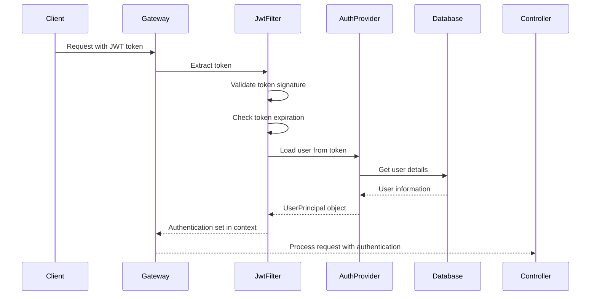

# Backend Architecture

## Service Architecture

### Controller/Route Organization

```
src/main/java/com/example/blog/
├── controller/           # REST API controllers
│   ├── AuthController.java
│   ├── ArticleController.java
│   ├── CommentController.java
│   ├── UserController.java
│   ├── CategoryController.java
│   ├── TagController.java
│   ├── FileController.java
│   └── AdminController.java
├── service/              # Business logic services
│   ├── AuthService.java
│   ├── ArticleService.java
│   ├── CommentService.java
│   ├── UserService.java
│   ├── CategoryService.java
│   ├── TagService.java
│   ├── FileStorageService.java
│   ├── SearchService.java
│   └── NotificationService.java
├── repository/           # Data access layer
│   ├── UserRepository.java
│   ├── ArticleRepository.java
│   ├── CommentRepository.java
│   ├── CategoryRepository.java
│   └── TagRepository.java
├── entity/               # JPA entities
│   ├── User.java
│   ├── Article.java
│   ├── Comment.java
│   ├── Category.java
│   ├── Tag.java
│   ├── ArticleTag.java
│   ├── ArticleLike.java
│   └── Notification.java
├── dto/                  # Data transfer objects
│   ├── request/
│   └── response/
├── config/               # Configuration classes
│   ├── SecurityConfig.java
│   ├── WebConfig.java
│   ├── RedisConfig.java
│   └── SwaggerConfig.java
├── exception/            # Exception handling
│   ├── GlobalExceptionHandler.java
│   ├── BusinessException.java
│   └── ResourceNotFoundException.java
├── security/             # Security components
│   ├── JwtAuthenticationFilter.java
│   ├── JwtTokenProvider.java
│   └── UserPrincipal.java
├── util/                 # Utility classes
└── BlogApplication.java  # Main application class
```

### Controller Template

```java
// src/main/java/com/example/blog/controller/ArticleController.java
@RestController
@RequestMapping("/api/v1/articles")
@Validated
@Slf4j
public class ArticleController {

    private final ArticleService articleService;

    public ArticleController(ArticleService articleService) {
        this.articleService = articleService;
    }

    @GetMapping
    public ResponseEntity<PageResponse<Article>> getArticles(
            @RequestParam(defaultValue = "0") int page,
            @RequestParam(defaultValue = "10") int size,
            @RequestParam(required = false) Long categoryId,
            @RequestParam(required = false) Long tagId,
            @RequestParam(required = false) String keyword,
            @RequestParam(required = false) String status) {

        ArticleQuery query = ArticleQuery.builder()
                .page(page)
                .size(size)
                .categoryId(categoryId)
                .tagId(tagId)
                .keyword(keyword)
                .status(status)
                .build();

        PageResponse<Article> response = articleService.getArticles(query);
        return ResponseEntity.ok(response);
    }

    @GetMapping("/{id}")
    public ResponseEntity<ArticleDetailResponse> getArticle(@PathVariable Long id) {
        ArticleDetailResponse response = articleService.getArticle(id);
        return ResponseEntity.ok(response);
    }

    @PostMapping
    @PreAuthorize("hasRole('USER')")
    public ResponseEntity<ArticleResponse> createArticle(
            @Valid @RequestBody CreateArticleRequest request,
            Authentication authentication) {

        String username = authentication.getName();
        ArticleResponse response = articleService.createArticle(request, username);
        return ResponseEntity.status(HttpStatus.CREATED).body(response);
    }

    @PutMapping("/{id}")
    @PreAuthorize("hasRole('USER') and @articleSecurity.isAuthor(#id, authentication.name)")
    public ResponseEntity<ArticleResponse> updateArticle(
            @PathVariable Long id,
            @Valid @RequestBody UpdateArticleRequest request) {

        ArticleResponse response = articleService.updateArticle(id, request);
        return ResponseEntity.ok(response);
    }

    @DeleteMapping("/{id}")
    @PreAuthorize("hasRole('USER') and @articleSecurity.isAuthor(#id, authentication.name)")
    public ResponseEntity<Void> deleteArticle(@PathVariable Long id) {
        articleService.deleteArticle(id);
        return ResponseEntity.noContent().build();
    }

    @PostMapping("/{id}/like")
    @PreAuthorize("hasRole('USER')")
    public ResponseEntity<Void> likeArticle(
            @PathVariable Long id,
            Authentication authentication) {

        String username = authentication.getName();
        articleService.likeArticle(id, username);
        return ResponseEntity.ok().build();
    }

    @DeleteMapping("/{id}/like")
    @PreAuthorize("hasRole('USER')")
    public ResponseEntity<Void> unlikeArticle(
            @PathVariable Long id,
            Authentication authentication) {

        String username = authentication.getName();
        articleService.unlikeArticle(id, username);
        return ResponseEntity.ok().build();
    }
}
```

## Database Architecture

### Schema Design

```sql
-- Additional indexes for performance optimization
CREATE INDEX idx_article_author_status ON t_article(author_id, status);
CREATE INDEX idx_article_category_publish ON t_article(category_id, publish_time);
CREATE INDEX idx_comment_article_level ON t_comment(article_id, level, create_time);
CREATE INDEX idx_notification_user_read ON t_notification(user_id, is_read);

-- Stored procedures for common operations
DELIMITER //
CREATE PROCEDURE UpdateArticleCounts(IN articleId INT)
BEGIN
    UPDATE t_article
    SET comment_count = (
        SELECT COUNT(*) FROM t_comment
        WHERE article_id = articleId AND status = 'NORMAL'
    ),
    like_count = (
        SELECT COUNT(*) FROM t_article_like
        WHERE article_id = articleId
    )
    WHERE id = articleId;
END //
DELIMITER ;

-- Triggers for maintaining data consistency
DELIMITER //
CREATE TRIGGER after_article_insert
AFTER INSERT ON t_article
FOR EACH ROW
BEGIN
    UPDATE t_category
    SET article_count = article_count + 1
    WHERE id = NEW.category_id;
END //

CREATE TRIGGER after_article_delete
AFTER DELETE ON t_article
FOR EACH ROW
BEGIN
    UPDATE t_category
    SET article_count = article_count - 1
    WHERE id = OLD.category_id;
END //
DELIMITER ;
```

### Data Access Layer

```java
// src/main/java/com/example/blog/repository/ArticleRepository.java
@Repository
public interface ArticleRepository extends JpaRepository<Article, Long>,
        JpaSpecificationExecutor<Article> {

    List<Article> findByAuthorIdAndStatus(Long authorId, ArticleStatus status);

    Page<Article> findByStatusAndCategoryId(
            ArticleStatus status,
            Long categoryId,
            Pageable pageable);

    @Query("SELECT a FROM Article a WHERE a.status = :status " +
           "AND (a.title LIKE %:keyword% OR a.content LIKE %:keyword%)")
    Page<Article> findByStatusAndKeyword(
            @Param("status") ArticleStatus status,
            @Param("keyword") String keyword,
            Pageable pageable);

    @Query("SELECT a FROM Article a JOIN a.tags t WHERE t.id = :tagId AND a.status = :status")
    Page<Article> findByTagIdAndStatus(
            @Param("tagId") Long tagId,
            @Param("status") ArticleStatus status,
            Pageable pageable);

    @Query("SELECT a FROM Article a WHERE a.isTop = true AND a.status = :status ORDER BY a.publishTime DESC")
    List<Article> findTopArticles(@Param("status") ArticleStatus status, Pageable pageable);

    @Modifying
    @Query("UPDATE Article a SET a.viewCount = a.viewCount + 1 WHERE a.id = :id")
    void incrementViewCount(@Param("id") Long id);
}
```

## Authentication and Authorization

### Auth Flow



### Middleware/Guards

```java
// src/main/java/com/example/blog/security/JwtAuthenticationFilter.java
@Component
@Slf4j
public class JwtAuthenticationFilter extends OncePerRequestFilter {

    private final JwtTokenProvider tokenProvider;
    private final UserDetailsService userDetailsService;

    @Override
    protected void doFilterInternal(
            HttpServletRequest request,
            HttpServletResponse response,
            FilterChain filterChain) throws ServletException, IOException {

        try {
            String jwt = getJwtFromRequest(request);

            if (StringUtils.hasText(jwt) && tokenProvider.validateToken(jwt)) {
                String username = tokenProvider.getUsernameFromJWT(jwt);
                UserDetails userDetails = userDetailsService.loadUserByUsername(username);

                UsernamePasswordAuthenticationToken authentication =
                    new UsernamePasswordAuthenticationToken(
                        userDetails, null, userDetails.getAuthorities());
                authentication.setDetails(new WebAuthenticationDetailsSource().buildDetails(request));

                SecurityContextHolder.getContext().setAuthentication(authentication);
            }
        } catch (Exception ex) {
            log.error("Could not set user authentication in security context", ex);
        }

        filterChain.doFilter(request, response);
    }

    private String getJwtFromRequest(HttpServletRequest request) {
        String bearerToken = request.getHeader("Authorization");
        if (StringUtils.hasText(bearerToken) && bearerToken.startsWith("Bearer ")) {
            return bearerToken.substring(7);
        }
        return null;
    }
}
```
