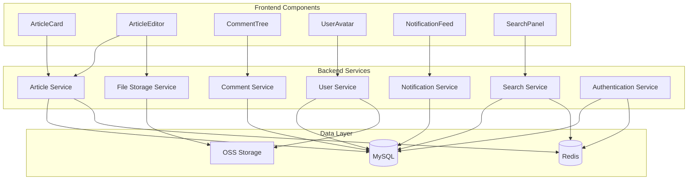

# Components

## Authentication Service

**Responsibility:** Handles user authentication, authorization, and session management

**Key Interfaces:**
- `register(username: string, email: string, password: string): Promise<User>` - User registration
- `login(username: string, password: string): Promise<AuthResponse>` - User login
- `refreshToken(refreshToken: string): Promise<TokenResponse>` - Token refresh
- `validateToken(token: string): Promise<boolean>` - JWT token validation
- `logout(token: string): Promise<void>` - User logout

**Dependencies:** User Repository, Password Encoder, JWT Provider, Redis

**Technology Stack:** Spring Security, JWT (jjwt), BCrypt, Redis

## Article Service

**Responsibility:** Manages article lifecycle including creation, editing, publishing, and deletion

**Key Interfaces:**
- `createArticle(article: CreateArticleRequest): Promise<Article>` - Create new article
- `updateArticle(id: number, article: UpdateArticleRequest): Promise<Article>` - Update article
- `getArticle(id: number): Promise<ArticleDetail>` - Get article by ID
- `getArticles(query: ArticleQuery): Promise<PageResult<Article>>` - Get paginated articles
- `publishArticle(id: number): Promise<void>` - Publish article
- `deleteArticle(id: number): Promise<void>` - Delete article
- `incrementViewCount(id: number): Promise<void>` - Increment view count

**Dependencies:** Article Repository, Category Repository, Tag Repository, File Storage Service

**Technology Stack:** Spring Boot, MyBatis Plus, MySQL, Redis

## Comment Service

**Responsibility:** Manages article comments including nested replies and moderation

**Key Interfaces:**
- `createComment(comment: CreateCommentRequest): Promise<Comment>` - Create comment
- `getComments(articleId: number, query: CommentQuery): Promise<PageResult<Comment>>` - Get comments
- `updateComment(id: number, content: string): Promise<Comment>` - Update comment
- `deleteComment(id: number): Promise<void>` - Delete comment
- `likeComment(id: number, userId: number): Promise<void>` - Like comment

**Dependencies:** Comment Repository, Article Repository, User Repository

**Technology Stack:** Spring Boot, MyBatis Plus, MySQL

## User Service

**Responsibility:** Manages user profiles, roles, and permissions

**Key Interfaces:**
- `getUserProfile(userId: number): Promise<User>` - Get user profile
- `updateProfile(userId: number, profile: UpdateProfileRequest): Promise<User>` - Update profile
- `uploadAvatar(userId: number, file: MultipartFile): Promise<string>` - Upload avatar
- `changePassword(userId: number, oldPassword: string, newPassword: string): Promise<void>` - Change password
- `getUsers(query: UserQuery): Promise<PageResult<User>>` - Get users (admin)

**Dependencies:** User Repository, File Storage Service

**Technology Stack:** Spring Boot, MyBatis Plus, Alibaba Cloud OSS

## File Storage Service

**Responsibility:** Handles file uploads and storage for avatars, article images, and attachments

**Key Interfaces:**
- `uploadFile(file: MultipartFile, type: FileType): Promise<FileUrl>` - Upload file
- `deleteFile(fileUrl: string): Promise<void>` - Delete file
- `getFileUrl(fileName: string): Promise<string>` - Get file URL

**Dependencies:** Alibaba Cloud OSS

**Technology Stack:** Alibaba Cloud OSS SDK, Spring Boot

## Search Service

**Responsibility:** Provides search functionality for articles, users, and tags

**Key Interfaces:**
- `searchArticles(query: SearchQuery): Promise<SearchResult<Article>>` - Search articles
- `searchUsers(query: SearchQuery): Promise<SearchResult<User>>` - Search users
- `getHotKeywords(limit: number): Promise<string[]>` - Get hot search keywords
- `saveSearchHistory(userId: number, keyword: string): Promise<void>` - Save search history

**Dependencies:** Article Repository, User Repository, Redis

**Technology Stack:** MyBatis Plus, Redis, MySQL Full-text Search

## Notification Service

**Responsibility:** Handles system notifications including comment replies, likes, and system messages

**Key Interfaces:**
- `sendNotification(notification: CreateNotificationRequest): Promise<void>` - Send notification
- `getUserNotifications(userId: number): Promise<Notification[]>` - Get user notifications
- `markAsRead(notificationId: number): Promise<void>` - Mark notification as read
- `markAllAsRead(userId: number): Promise<void>` - Mark all notifications as read

**Dependencies:** Notification Repository, Email Service

**Technology Stack:** Spring Boot, MyBatis Plus

## Frontend Components

### ArticleCard Component

**Responsibility:** Display article summary in list/grid view

**Key Interfaces:**
- Props: `article: Article`, `showAuthor?: boolean`, `showCategory?: boolean`
- Events: `@click`, `@like`, `@share`

**Dependencies:** Vue 3, Element Plus, Vue Router

### ArticleEditor Component

**Responsibility:** Provide rich text editing for article creation and editing

**Key Interfaces:**
- Props: `initialContent?: string`, `mode?: 'edit' | 'preview' | 'split'`
- Events: `@save`, `@publish`, `@content-change`
- Methods: `insertImage()`, `insertLink()`, `getMarkdown()`

**Dependencies:** Vue 3, Markdown Editor Library, Element Plus

### CommentTree Component

**Responsibility:** Display hierarchical comment structure with nested replies

**Key Interfaces:**
- Props: `comments: Comment[]`, `articleId: number`
- Events: `@reply`, `@like`, `@delete`
- Methods: `loadMore()`, `scrollToComment()`

**Dependencies:** Vue 3, Element Plus, Comment Service

### UserAvatar Component

**Responsibility:** Display user avatar with fallback options

**Key Interfaces:**
- Props: `user: User`, `size?: 'small' | 'medium' | 'large'`
- Events: `@click`

**Dependencies:** Vue 3, Element Plus

## Component Diagrams

