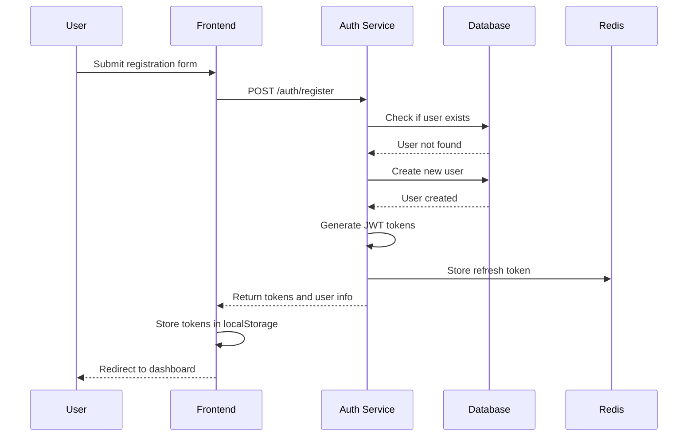
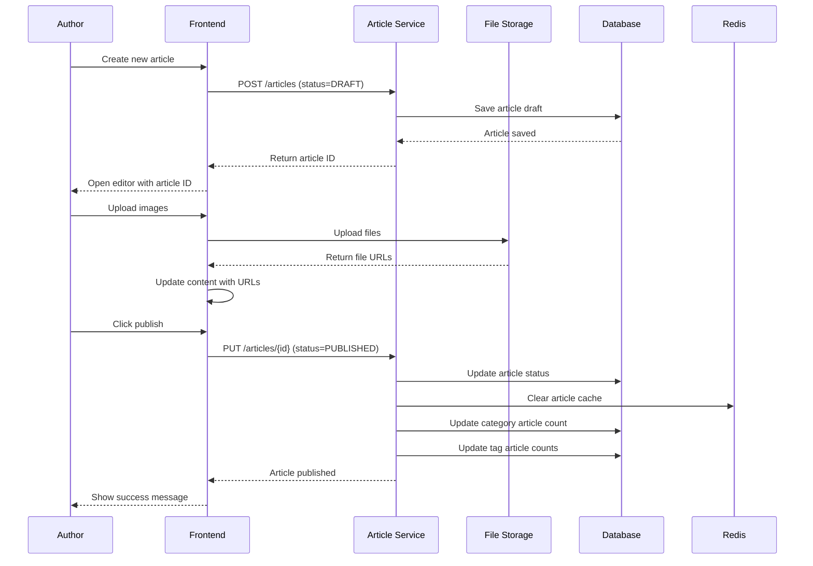
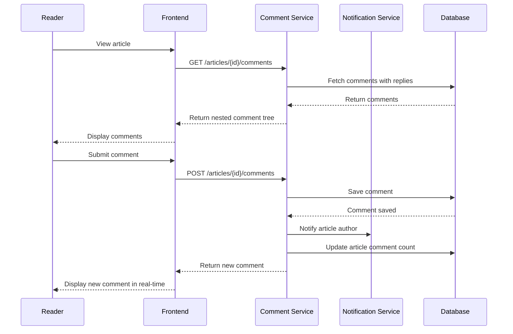

# Core Workflows

## User Registration and Login Flow

```mermaid
sequenceDiagram
    participant User
    participant Frontend
    participant Auth Service
    participant Database
    participant Redis

    User->>Frontend: Submit registration form
    Frontend->>Auth Service: POST /auth/register
    Auth Service->>Database: Check if user exists
    Database-->>Auth Service: User not found
    Auth Service->>Database: Create new user
    Database-->>Auth Service: User created
    Auth Service->>Auth Service: Generate JWT tokens
    Auth Service->>Redis: Store refresh token
    Auth Service-->>Frontend: Return tokens and user info
    Frontend->>Frontend: Store tokens in localStorage
    Frontend-->>User: Redirect to dashboard
```

## Article Creation and Publishing Flow

```mermaid
sequenceDiagram
    participant Author
    participant Frontend
    participant Article Service
    participant File Storage
    participant Database
    participant Redis

    Author->>Frontend: Create new article
    Frontend->>Article Service: POST /articles (status=DRAFT)
    Article Service->>Database: Save article draft
    Database-->>Article Service: Article saved
    Article Service-->>Frontend: Return article ID
    Frontend-->>Author: Open editor with article ID

    Author->>Frontend: Upload images
    Frontend->>File Storage: Upload files
    File Storage-->>Frontend: Return file URLs
    Frontend->>Frontend: Update content with URLs

    Author->>Frontend: Click publish
    Frontend->>Article Service: PUT /articles/{id} (status=PUBLISHED)
    Article Service->>Database: Update article status
    Article Service->>Redis: Clear article cache
    Article Service->>Database: Update category article count
    Article Service->>Database: Update tag article counts
    Article Service-->>Frontend: Article published
    Frontend-->>Author: Show success message
```

## Comment Interaction Flow

```mermaid
sequenceDiagram
    participant Reader
    participant Frontend
    participant Comment Service
    participant Notification Service
    participant Database

    Reader->>Frontend: View article
    Frontend->>Comment Service: GET /articles/{id}/comments
    Comment Service->>Database: Fetch comments with replies
    Database-->>Comment Service: Return comments
    Comment Service-->>Frontend: Return nested comment tree
    Frontend-->>Reader: Display comments

    Reader->>Frontend: Submit comment
    Frontend->>Comment Service: POST /articles/{id}/comments
    Comment Service->>Database: Save comment
    Database-->>Comment Service: Comment saved
    Comment Service->>Notification Service: Notify article author
    Comment Service->>Database: Update article comment count
    Comment Service-->>Frontend: Return new comment
    Frontend-->>Reader: Display new comment in real-time
```
