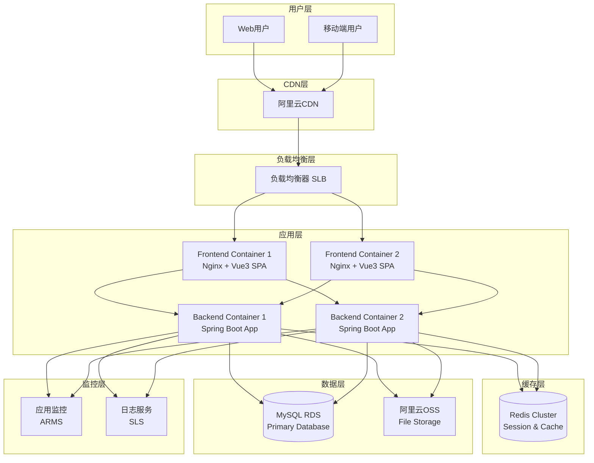

# High Level Architecture

## Technical Summary

This is a monolithic fullstack application built with Spring Boot backend and Vue3 frontend, deployed on a cloud platform with MySQL database and Redis cache. The architecture follows traditional MVC patterns on the backend with RESTful APIs, while the frontend uses a component-based architecture with Vue3 Composition API. The system is designed for scalability with horizontal scaling capabilities, though initially deployed as a single instance. Authentication is handled via JWT tokens with refresh mechanism, and the entire application is containerized using Docker for consistent deployment environments.

## Platform and Infrastructure Choice

**Platform:** 阿里云 (Alibaba Cloud)
**Key Services:** ECS (Elastic Compute Service), RDS for MySQL, Redis for caching, OSS for file storage, SLB for load balancing
**Deployment Host and Regions:** 华东1 (杭州) Region

**Rationale for Platform Choice:**
- 阿里云在国内的网络优势，为大学生用户群体提供更好的访问速度
- 完整的产品生态，涵盖计算、存储、数据库、CDN等所需服务
- 有学生优惠计划，符合项目预算考虑
- 提供Docker容器支持，便于现代化部署
- 稳定的服务和技术支持

## Repository Structure

**Structure:** Monorepo
**Monorepo Tool:** Maven多模块 + npm workspaces
**Package Organization:**
- blog-backend: Spring Boot后端模块
- blog-frontend: Vue3前端模块
- blog-shared: 共享类型定义和工具类
- blog-docs: 项目文档

## High Level Architecture Diagram

## Architectural Patterns

- **MVC Pattern:** Backend follows Model-View-Controller pattern - _Rationale:_ Clear separation of concerns, established Spring Boot pattern
- **Component-Based UI:** Reusable Vue3 components with Composition API - _Rationale:_ Modern, maintainable frontend architecture with TypeScript support
- **RESTful API Design:** Standard HTTP methods and status codes - _Rationale:_ Widely understood, stateless, cacheable by nature
- **Repository Pattern:** Abstract data access logic - _Rationale:_ Enables testing and future database migration flexibility
- **JWT Authentication:** Token-based stateless authentication - _Rationale:_ Scalable, works well with microservices architecture
- **CQRS (Command Query Responsibility Segregation):** Separate read/write operations for complex queries - _Rationale:_ Performance optimization for read-heavy operations
- **Event-Driven Architecture:** Asynchronous processing for non-critical operations - _Rationale:_ Improves system responsiveness and scalability
