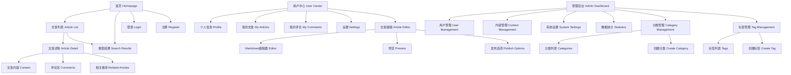
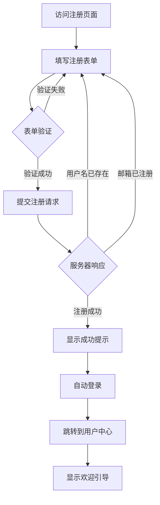
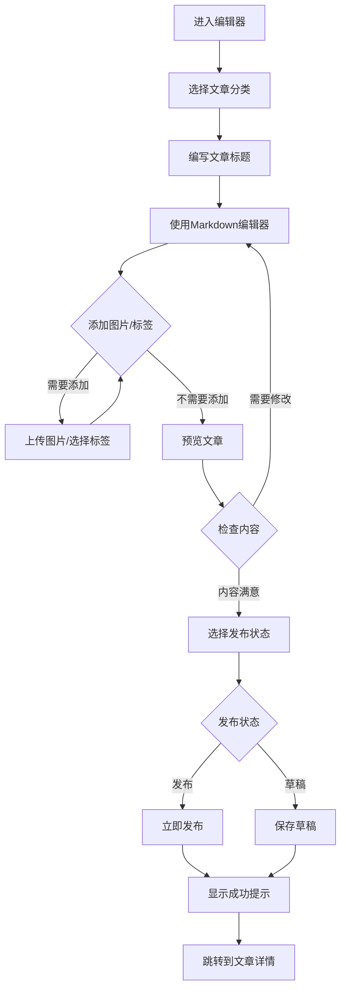
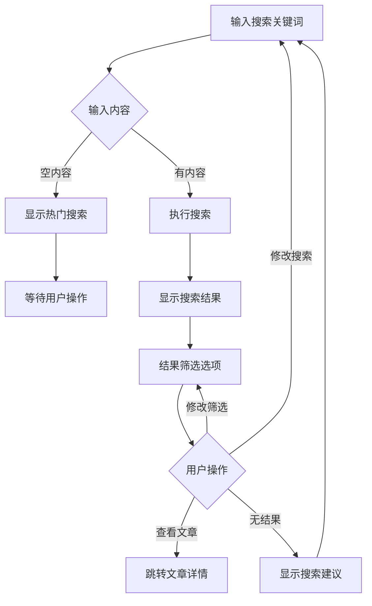
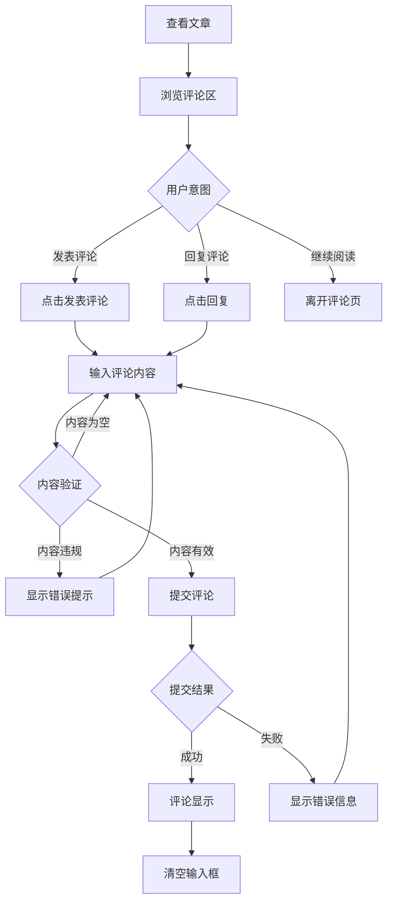

# 大学生个人博客系统 UI/UX Specification

## Introduction

This document defines the user experience goals, information architecture, user flows, and visual design specifications for 大学生个人博客系统's user interface. It serves as the foundation for visual design and frontend development, ensuring a cohesive and user-centered experience.

### Overall UX Goals & Principles

#### Target User Personas

- **大学生博主 (Student Blogger):** 18-25岁在校大学生，技术能力强，追求高效的内容创作和分享体验，需要简洁直观的界面来专注于内容创作，同时希望建立个人技术品牌。

- **普通读者 (Casual Reader):** 广大互联网用户，寻找特定主题内容或浏览感兴趣的文章，重视阅读体验和内容发现，需要清晰的导航和快速的页面加载。

- **管理员 (Administrator):** 系统维护者，需要全面的内容和用户管理能力，重视数据统计和批量操作功能，需要高效的界面来处理大量数据。

#### Usability Goals

- **易学性:** 新用户能在5分钟内完成注册并发布第一篇文章
- **效率性:** 活跃用户能在3次点击内完成常用操作（发布文章、管理评论）
- **防错性:** 明确的表单验证和确认提示，防止误操作
- **可记忆性:** 不常用用户返回时无需重新学习界面操作
- **满意度:** 用户满意度评分达到4.5/5分以上

#### Design Principles

1. **内容优先** - 界面设计突出内容展示，减少不必要的视觉干扰
2. **渐进式展示** - 根据用户需求逐步展示功能，避免界面过于复杂
3. **一致性模式** - 在整个应用中使用熟悉的UI模式和交互方式
4. **即时反馈** - 每个操作都有清晰、即时的响应
5. **无障碍默认** - 从一开始就为所有用户设计
6. **移动优先** - 先考虑移动端体验，再扩展到桌面端

### Change Log

| Date | Version | Description | Author |
|------|---------|-------------|---------|
| 2025-12-15 | 1.0 | 初始UI/UX规格说明版本创建，基于PRD文档 | Sally (UX Expert) |

## Information Architecture (IA)

### Site Map / Screen Inventory

### Navigation Structure

**Primary Navigation:** 顶部导航栏包含Logo、首页、分类、标签、搜索框、用户头像/登录按钮。导航栏固定在页面顶部，支持滚动时保持可见。

**Secondary Navigation:** 用户登录后显示用户下拉菜单（个人中心、我的文章、退出），管理员额外显示管理入口。侧边栏用于管理后台的多级导航。

**Breadcrumb Strategy:** 在管理后台和深层页面使用面包屑导航，显示当前页面在系统中的位置，提供快速返回上级页面的能力。

## User Flows

### 用户注册流程 (User Registration Flow)

**User Goal:** 新用户快速注册账户并开始使用博客系统

**Entry Points:** 首页注册按钮、登录页面注册链接、直接访问注册页面

**Success Criteria:** 用户成功创建账户，收到欢迎邮件，自动跳转到用户中心

#### Flow Diagram

#### Edge Cases & Error Handling:
- 用户名格式不符合要求时实时提示
- 邮箱格式错误或已存在时给出明确错误信息
- 密码强度不足时提供改进建议
- 网络请求失败时提供重试选项
- 验证码错误时自动刷新验证码

#### Notes:
注册成功后自动登录，避免用户重复输入凭据。提供社交登录选项作为快捷方式。

### 文章发布流程 (Article Publishing Flow)

**User Goal:** 用户创建、编辑并发布文章内容

**Entry Points:** 用户中心"写文章"按钮、文章列表页新建按钮、快捷菜单

**Success Criteria:** 文章成功发布，在首页可见，作者收到发布确认

#### Flow Diagram

#### Edge Cases & Error Handling:
- 文章标题为空时阻止发布并提示
- 内容为空时保存为草稿但不允许发布
- 图片上传失败时提供重新上传选项
- 网络中断时自动保存为草稿
- 发布失败时保留内容并允许重试

#### Notes:
提供自动保存功能，每5分钟自动保存草稿。支持实时预览，帮助用户检查格式。

### 文章搜索流程 (Article Search Flow)

**User Goal:** 用户快速找到感兴趣的文章内容

**Entry Points:** 首页搜索框、导航栏搜索、页面内搜索

**Success Criteria:** 用户找到相关文章，能够通过筛选进一步缩小结果

#### Flow Diagram

#### Edge Cases & Error Handling:
- 搜索结果为空时提供相关建议
- 网络错误时显示搜索失败提示
- 搜索超时时提供重试选项
- 输入特殊字符时进行安全过滤
- 搜索历史记录本地存储

#### Notes:
支持搜索建议和自动完成功能。保存用户搜索历史，方便重复搜索。

### 评论互动流程 (Comment Interaction Flow)

**User Goal:** 用户对文章进行评论和回复，与其他读者交流

**Entry Points:** 文章详情页评论区、回复按钮

**Success Criteria:** 评论成功发布，作者和其他用户收到通知

#### Flow Diagram

#### Edge Cases & Error Handling:
- 评论内容过长时提示字数限制
- 包含敏感词汇时进行过滤或警告
- 网络提交失败时保存内容到草稿
- 重复提交时显示防刷提示
- 被删除的评论显示为"该评论已被删除"

#### Notes:
支持Markdown格式的评论内容。实时字符计数提醒用户输入限制。

## Wireframes & Mockups

### Primary Design Files

设计文件将使用Figma创建，包含完整的UI设计和交互原型。链接将在设计完成后提供。

### Key Screen Layouts

#### 首页 (Homepage)

**Purpose:** 展示最新文章，提供内容发现和导航入口

**Key Elements:**
- 顶部导航栏（Logo、主导航菜单、搜索框、用户登录/头像）
- 轮播文章展示区（3篇精选文章）
- 文章列表区域（卡片式布局，包含标题、摘要、作者、时间）
- 侧边栏（热门标签、分类导航、最新评论）
- 页脚（版权信息、友情链接）

**Interaction Notes:** 支持无限滚动加载更多文章，文章卡片悬停时显示更多操作选项

**Design File Reference:** Figma Frame - Homepage_v1

#### 文章详情页 (Article Detail Page)

**Purpose:** 完整展示文章内容，提供阅读和互动功能

**Key Elements:**
- 文章标题区域（标题、作者信息、发布时间、阅读量）
- 文章内容区域（Markdown渲染、代码高亮）
- 文章操作区域（点赞、收藏、分享、编辑/删除）
- 评论区（评论列表、回复功能、发表评论）
- 相关文章推荐（基于标签和分类）

**Interaction Notes:** 支持文章目录导航，评论区支持嵌套回复和排序

**Design File Reference:** Figma Frame - ArticleDetail_v1

#### 文章编辑器 (Article Editor)

**Purpose:** 提供高效的文章创作和编辑环境

**Key Elements:**
- 工具栏（格式化按钮、插入图片/链接、预览切换）
- 编辑器区域（Markdown编辑器、实时预览）
- 设置面板（分类选择、标签添加、发布设置）
- 状态栏（字数统计、保存状态、发布状态）

**Interaction Notes:** 支持快捷键操作，自动保存功能，拖拽上传图片

**Design File Reference:** Figma Frame - ArticleEditor_v1

#### 用户中心 (User Center)

**Purpose:** 管理个人信息和内容，查看统计数据

**Key Elements:**
- 用户信息卡片（头像、昵称、个人简介、统计数据）
- 功能导航（我的文章、我的评论、个人设置）
- 内容列表（文章管理、评论管理）
- 快捷操作（写文章、个人资料编辑）

**Interaction Notes:** 支持批量操作，提供内容统计可视化

**Design File Reference:** Figma Frame - UserCenter_v1

#### 管理后台 (Admin Dashboard)

**Purpose:** 系统管理和数据监控

**Key Elements:**
- 数据概览（用户数、文章数、访问量统计）
- 功能导航（用户管理、内容管理、系统设置）
- 快捷操作（最新评论、待审核内容）
- 数据图表（访问趋势、用户活跃度）

**Interaction Notes:** 支持高级筛选和批量管理操作

**Design File Reference:** Figma Frame - AdminDashboard_v1

## Component Library / Design System

### Design System Approach

采用Element Plus作为基础UI组件库，结合自定义主题和组件扩展，确保设计一致性和开发效率。建立完整的设计系统，包含色彩、字体、间距、图标等设计规范。

### Core Components

#### 导航栏组件 (Navigation Component)

**Purpose:** 提供网站主导航和用户操作入口

**Variants:**
- 顶部导航栏（所有页面）
- 侧边导航栏（管理后台）
- 面包屑导航（深层页面）

**States:**
- 默认状态（普通显示）
- 滚动状态（固定在顶部）
- 移动端状态（折叠菜单）

**Usage Guidelines:** 始终保持在页面顶部，移动端提供汉堡菜单。Logo点击返回首页。

#### 文章卡片组件 (Article Card Component)

**Purpose:** 以卡片形式展示文章摘要信息

**Variants:**
- 列表模式（简洁布局）
- 网格模式（紧凑布局）
- 特色模式（大图展示）

**States:**
- 默认状态（正常显示）
- 悬停状态（显示操作按钮）
- 加载状态（骨架屏）

**Usage Guidelines:** 保持卡片高度一致，图片比例统一。提供清晰的视觉层次。

#### 编辑器组件 (Editor Component)

**Purpose:** 提供Markdown编辑和预览功能

**Variants:**
- 编辑模式（专注写作）
- 预览模式（实时预览）
- 分屏模式（编辑+预览）

**States:**
- 正常状态（可编辑）
- 只读状态（查看模式）
- 全屏状态（沉浸式写作）

**Usage Guidelines:** 支持快捷键操作，自动保存功能。工具栏可自定义显示。

#### 评论组件 (Comment Component)

**Purpose:** 展示和管理用户评论

**Variants:**
- 评论列表（折叠/展开）
- 单条评论（简洁/详细）
- 回复框（嵌套显示）

**States:**
- 正常状态（可交互）
- 加载状态（显示加载中）
- 错误状态（显示错误信息）

**Usage Guidelines:** 支持无限层级回复，评论时间使用相对时间显示。

## Branding & Style Guide

### Visual Identity

**Brand Guidelines:** 遵循现代Web设计趋势，突出学术和专业氛围，保持清新简洁的视觉风格。参考GitHub、Medium等优秀博客平台的设计理念。

### Color Palette

| Color Type | Hex Code | Usage |
|------------|----------|-------|
| Primary | #1890ff | 主要按钮、链接、高亮元素 |
| Secondary | #52c41a | 成功状态、确认操作 |
| Accent | #fa8c16 | 警告提示、重要信息 |
| Success | #52c41a | 成功反馈、正面消息 |
| Warning | #faad14 | 警告信息、注意事项 |
| Error | #ff4d4f | 错误信息、危险操作 |
| Neutral | #f0f2f5, #d9d9d9, #8c8c8c, #595959, #262626, #000000 | 背景、边框、文本 |

### Typography

#### Font Families
- **Primary:** -apple-system, BlinkMacSystemFont, 'Segoe UI', Roboto, sans-serif
- **Secondary:** 'PingFang SC', 'Hiragino Sans GB', 'Microsoft YaHei', sans-serif
- **Monospace:** 'SFMono-Regular', Consolas, 'Liberation Mono', Menlo, monospace

#### Type Scale

| Element | Size | Weight | Line Height |
|---------|------|--------|-------------|
| H1 | 32px | 600 | 1.2 |
| H2 | 24px | 600 | 1.3 |
| H3 | 20px | 600 | 1.4 |
| Body | 14px | 400 | 1.5 |
| Small | 12px | 400 | 1.5 |

### Iconography

**Icon Library:** Element Plus内置图标 + 自定义SVG图标

**Usage Guidelines:** 保持图标风格一致，使用线性图标。提供清晰的视觉识别，图标尺寸保持统一。

### Spacing & Layout

**Grid System:** 基于24px的基础网格系统，使用Flexbox和CSS Grid布局

**Spacing Scale:** 4px基础间距单位，常用间距：4px, 8px, 12px, 16px, 24px, 32px, 48px, 64px

## Accessibility Requirements

### Compliance Target

**Standard:** WCAG 2.1 AA级别

### Key Requirements

**Visual:**
- Color contrast ratios: 正常文本4.5:1，大文本3:1
- Focus indicators: 2px宽度的实线轮廓，对比度至少3:1
- Text sizing: 支持200%缩放而不损失功能

**Interaction:**
- Keyboard navigation: 所有功能都可通过键盘访问，Tab顺序逻辑清晰
- Screen reader support: 提供适当的ARIA标签和语义化HTML
- Touch targets: 最小44px × 44px的触摸目标尺寸

**Content:**
- Alternative text: 所有图片提供描述性alt文本
- Heading structure: 合理的标题层级结构（h1-h6）
- Form labels: 所有表单控件都有明确的标签关联

### Testing Strategy

使用axe-core自动化测试工具进行基础检测，结合手动键盘导航测试和屏幕阅读器测试。定期进行无障碍用户测试，持续改进体验。

## Responsiveness Strategy

### Breakpoints

| Breakpoint | Min Width | Max Width | Target Devices |
|------------|-----------|-----------|----------------|
| Mobile | 320px | 767px | 手机设备 |
| Tablet | 768px | 1023px | 平板设备 |
| Desktop | 1024px | 1439px | 笔记本电脑 |
| Wide | 1440px | - | 台式电脑 |

### Adaptation Patterns

**Layout Changes:** 移动端使用单列布局，平板端使用两列布局，桌面端使用多列布局。导航栏在小屏幕下折叠为汉堡菜单。

**Navigation Changes:** 移动端使用底部标签导航，桌面端使用顶部导航栏。侧边栏在小屏幕下转换为抽屉式菜单。

**Content Priority:** 移动端优先显示核心内容，隐藏次要信息。使用折叠面板和Tab组件组织内容。

**Interaction Changes:** 移动端优化触摸交互，增大点击目标。使用滑动操作替代部分点击操作。

## Animation & Micro-interactions

### Motion Principles

遵循Material Design的动画原则，提供自然的运动轨迹和合适的动画时长。避免过度的动画效果，保持界面性能和可访问性。

### Key Animations

- **页面切换:** 淡入淡出效果（Duration: 300ms, Easing: ease-in-out）
- **悬停效果:** 轻微放大和阴影变化（Duration: 200ms, Easing: ease-out）
- **点击反馈:** 涟漪效果或缩放动画（Duration: 150ms, Easing: ease-out）
- **加载状态:** 骨架屏渐变动画（Duration: 1.5s, Easing: linear）
- **通知提示:** 滑入滑出动画（Duration: 400ms, Easing: cubic-bezier）

## Performance Considerations

### Performance Goals

- **Page Load:** 首屏加载时间小于2秒
- **Interaction Response:** 交互响应时间小于100ms
- **Animation FPS:** 动画帧率保持60fps

### Design Strategies

使用图片懒加载和WebP格式优化图片加载。采用CSS Grid和Flexbox布局避免重排重绘。使用CSS动画替代JavaScript动画提升性能。合理使用字体子集减少字体加载时间。

## Next Steps

### Immediate Actions

1. 在Figma中创建详细的设计稿和交互原型
2. 与产品经理和开发团队评审设计方案
3. 创建组件库的设计文档和规格说明
4. 准备设计交付给前端开发团队

### Design Handoff Checklist

- [x] 所有用户流程已文档化
- [x] 组件清单已完成
- [x] 无障碍需求已定义
- [x] 响应式策略已明确
- [x] 品牌指导原则已整合
- [x] 性能目标已建立